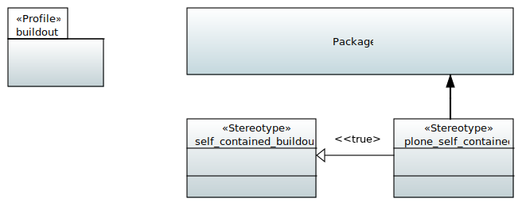

.. _profile_buildout:

====================
UML:Profile buildout
====================

Overview
--------

**buildout** UML profile overview.

.. note:: 

  At this stage, **agx.generator.buildout** only supports
  generation of buildouts for Plone version 4.1.2.

.. note:: A more general description can be found here: :ref:`users_buildout`

.. list-table:: **List of Stereotypes**
   :widths: 45 10 45
   :header-rows: 1

   * - UML:Stereotype
     - Metaclasses
     - Tagged Values
   * - name of stereotype with link to details
     - applicable to
     - see link for description
   * - :ref:`st_self_contained_buildout`
     - n/a
     - None
   * - :ref:`st_plone_self_contained`
     - UML:Package
     - None

.. _st_self_contained_buildout:

UML:Stereotype <<self_contained_buildout>>
------------------------------------------

Settings for a self contained buildout.

Metaclasses
~~~~~~~~~~~

- n/a

Tagged Values
~~~~~~~~~~~~~

**None**

.. _st_plone_self_contained:

UML:Stereotype <<plone_self_contained>>
---------------------------------------

Settings for a self contained Plone 4.1.2 buildout.
Specialisation of :ref:`st_self_contained_buildout`.

Metaclasses
~~~~~~~~~~~

- UML:Package

Tagged Values
~~~~~~~~~~~~~

**None**
