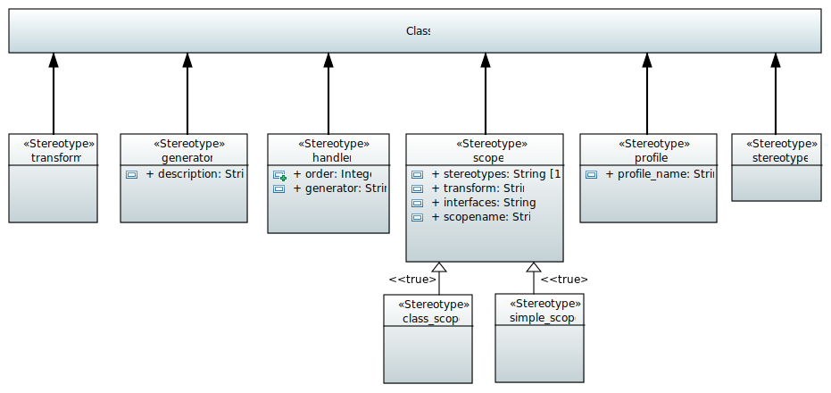
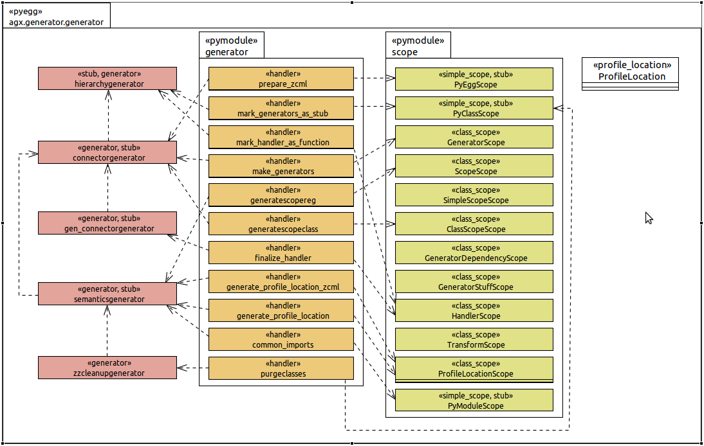
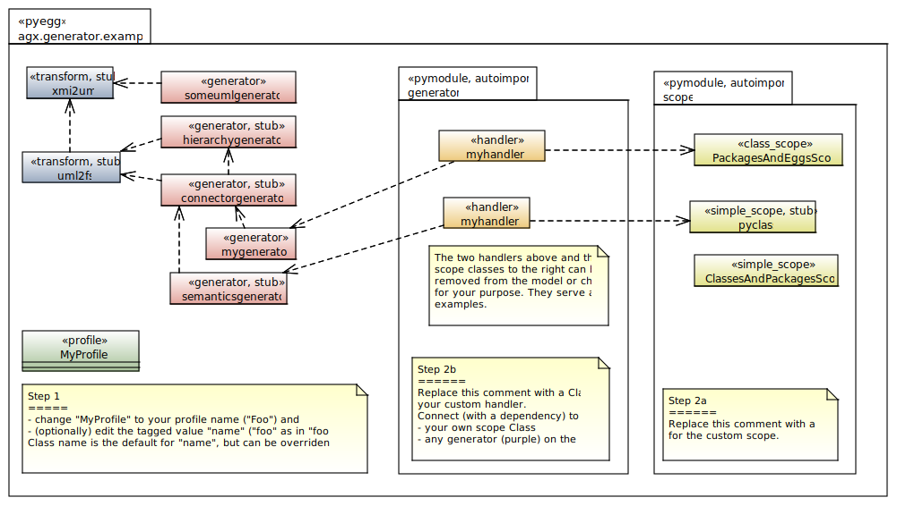

======================
UML:Profile generator
======================

The generator used when generating code from UML models with AGX is also modeled
and generated using UML and AGX.

Click on this image for a larger view.

The Generators Model
=====================

The Template Model
==================

The following model is used as a template
when you use the wizard to build your own generator.

There are comments in the model to guide your way:

* Change the name of the class "MyProfile" (green) to fit the name of your profile.
* (optionally) If you want to override the file name (default: lowercase class name),
  change the tagged value "name".
* Add a class for the scope of your generator.
* Add a class for your generators handler.

For an explanation of the terms **scope** and **handler** see :ref:`under_the_hood-components_of_transformation_chain`.

