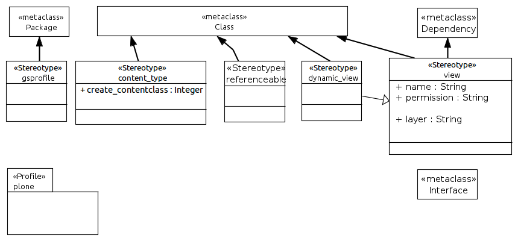

.. _profile_plone:

==================
UML:Profile plone
==================

This document describes the UML profile used for Plone Products
with Generic Setup profiles. 

Overview
---------

.. note:: A more general description can be found here: :ref:`users_plone`

UML:Stereotype <<gsprofile>>
-----------------------------

This stereotype can be attached to packages. In combination with the <<pyegg>>
stereotype can build eggs good for use as plugins for Plone.

Metaclasses
~~~~~~~~~~~~
- UML:Package

Tagged Values
~~~~~~~~~~~~~~

**None**

UML:Stereotype <<content_type>>
--------------------------------

Turn a class into a content type.

Metaclasses
~~~~~~~~~~~~
- UML:Class

Tagged Values
~~~~~~~~~~~~~~

**create_contentclass**
    Integer

UML:Stereotype <<referencable>>
--------------------------------

This stereotype can be attached to classes if they are to be made referencable.

Metaclasses
~~~~~~~~~~~~
- UML:Class

Tagged Values
~~~~~~~~~~~~~~

**None**

UML:Stereotype <<dynamic view>>
--------------------------------

A dynamic view class. It actually is a view

Metaclasses
~~~~~~~~~~~~
- UML:Class

Tagged Values
~~~~~~~~~~~~~~

**None**

UML:Stereotype <<view>>
------------------------

This stereotype can be attached to packages.

Metaclasses
~~~~~~~~~~~~
- UML:Class
- UML:Dependency

Tagged Values
~~~~~~~~~~~~~~

**name**
    String: name of the view.

**permission**
    String: permission for that view.

**layer**
    String: the layer the view is in.

