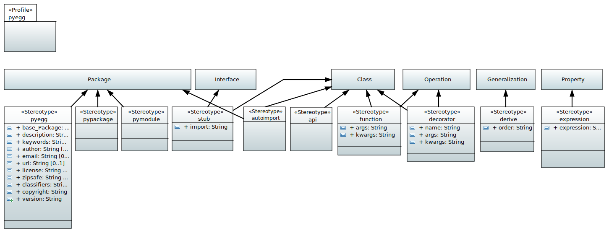

.. _profile_pyegg:

=================
UML:Profile pyegg
=================

Create Python Eggs and generate Python Code.

Overview
--------

**pyegg** UML profile overview.

This image shows the diagram of the **pyegg** profile.

Below, you can find a listing of the stereotypes from this profile, with some
information about the diagramm elements they can be applied to, and some
information about the relevant tagged values.

.. list-table:: **List of Stereotypes**
   :widths: 45 10 45
   :header-rows: 1

   * - UML:Stereotype
     - Metaclasses
     - Tagged Values
   * - name of stereotype with link to details
     - applicable to
     - see link for description
   * - :ref:`st_pyegg`
     - UML:Package
     - version, description, authors, email, keywords, url, license,
       zipsafe, classifiers, copyrights
   * - :ref:`st_pypackage`
     - UML:Package
     - None
   * - :ref:`st_pymodule`
     - UML:Package
     - None
   * - :ref:`st_stub`
     - UML:Interface, UML:Class
     - import
   * - :ref:`st_api`
     - UML:Class
     - None
   * - :ref:`st_function`
     - UML:Class, UML:Operation
     - args, kwargs
   * - :ref:`st_decorator`
     - UML:Class, UML:Operation
     - name, args, kwargs
   * - :ref:`st_derive`
     - UML:Generalization
     - order
   * - :ref:`st_expression`
     - UML:Property
     - expression

.. _st_pyegg:

UML:Stereotype <<pyegg>>
------------------------

Create or point at (reference and import) a complete python egg structure. 
A pyegg package can be given a dotted name. A split name represents namespace
packages. Package directories are located in the ``src`` folder of the egg
root. A ``README.txt`` is created if inexistent. ``setup.py`` is created or
referenced.

Metaclasses
~~~~~~~~~~~
- UML:Package

Tagged Values
~~~~~~~~~~~~~
**version**
    Used as ``version`` in setup.

**description**
    Used as ``description`` in setup.

**author**
    Used as ``author`` in setup.

**email**
    Used as ``author_email`` in setup.

**keywords**
    Used as ``keywords`` in setup.

**url**
    Used as ``url`` in setup.

**license**
    Used as ``license`` in setup.

**zipsafe**
    Used as ``zipsafe`` in setup. Either ``True`` or ``False``.

**classifiers**
    Used as ``classifiers`` in setup. Valid Classifiers can be
    found at  `<http://pypi.python.org/pypi?%3Aaction=list_classifiers>`_.
    Classifiers must be separated by comma (``,``).

**copyright**
    Used as copyright header for python modules. A linebreak is
    indicated by linefeed (``\n``).

.. _st_pypackage:

UML:Stereotype <<pypackage>>
----------------------------

UML-Package is treated as Python package (a directory with an ``__init_.py``)`.
Create or point to the directory with package name and create or point at a
package's ``__init__.py`` file.

Metaclasses
~~~~~~~~~~~

- UML:Package

Tagged Values
~~~~~~~~~~~~~

**None**

.. _st_pymodule:

UML:Stereotype <<pymodule>>
---------------------------

Treat package as python module (i.e. a single python file).
Thus create or point at a python file with a package name.
All classes in this package are written into the same module as opposed to
creating module files for each class in a UML package if marked with the
``pypackage`` stereotype.

Metaclasses
~~~~~~~~~~~

- UML:Package

Tagged Values
~~~~~~~~~~~~~

**None**

.. _st_stub:

UML:Stereotype <<stub>>
-----------------------

Indicate class as stub. Used for generalization of 3rd-party objects.

Create a UML:Class somewhere in the model, give it the name of the class or
module you want to import, add the **<<stub>>** stereotype and change the
Prpoerty value of **import** in the properties view under *Profile*.

Metaclasses
~~~~~~~~~~~
- UML:Class
- UML:Interface

Tagged Values
~~~~~~~~~~~~~

**import**
    Package name to import general class from, i.e. assuming class name is
    ``Baz``, setting value to ``foo.bar`` results in
    ``from foo.bar import Baz``.

.. _st_api:

UML:Stereotype <<api>>
-----------------------
Indicate class as API. Will create imports of this class in the package/egg,
so it is loaded, when the package is imported from some other module.

Metaclasses
~~~~~~~~~~~
- UML:Class

Tagged Values
~~~~~~~~~~~~~
None

.. _st_function:

UML:Stereotype <<function>>
----------------------------
Define a python function.

Metaclasses
~~~~~~~~~~~
- UML:Class
- UML:Operation

Tagged Values
~~~~~~~~~~~~~
**args**
    Arguments passed to decorator, i.e. ``foo, bar``. Arguments must be
    separated by comma (``,``).

**kwargs**
    Keyword arguments passed to decorator, i.e. ``foo=0, bar=1``. Keyword
    arguments must be separated by comma (``,``).

.. _st_decorator:

UML:Stereotype <<decorator>>
----------------------------

Define a python decorator.

If ``args`` and ``kwargs`` are omitted in the model, they're never touched,
change them in the generated code as you like.

Metaclasses
~~~~~~~~~~~

- UML:Class
- UML:Operation

Tagged Values
~~~~~~~~~~~~~

**name**
    Decorator name.

**args**
    Arguments passed to decorator, i.e. ``foo, bar``. Arguments must be
    separated by comma (``,``).

**kwargs**
    Keyword arguments passed to decorator, i.e. ``foo=0, bar=1``. Keyword
    arguments must be separated by comma (``,``).

.. _st_derive:

UML:Stereotype <<derive>>
-------------------------

Derive settings.

Metaclasses
~~~~~~~~~~~

- UML:Generalization

Tagged Values
~~~~~~~~~~~~~

**order**
    If UML Class inherits from 2 or more bases but order matters, set integer
    value for all generalizations. Lower value for the one needed first.

.. _st_expression:

UML:Stereotype <<expression>>
-----------------------------

Set an expression for UML Property. Normally you do not model properties on
python level, except they are useful for documentation or semantic reasons.
Even if, value is set to ``None`` by default. Expression stereotype provides
changing this.

Metaclasses
~~~~~~~~~~~

- UML:Property

Tagged Values
~~~~~~~~~~~~~

**expression**
    Some python expression, e.g. ``[x for x in ["xxx"]]``.

