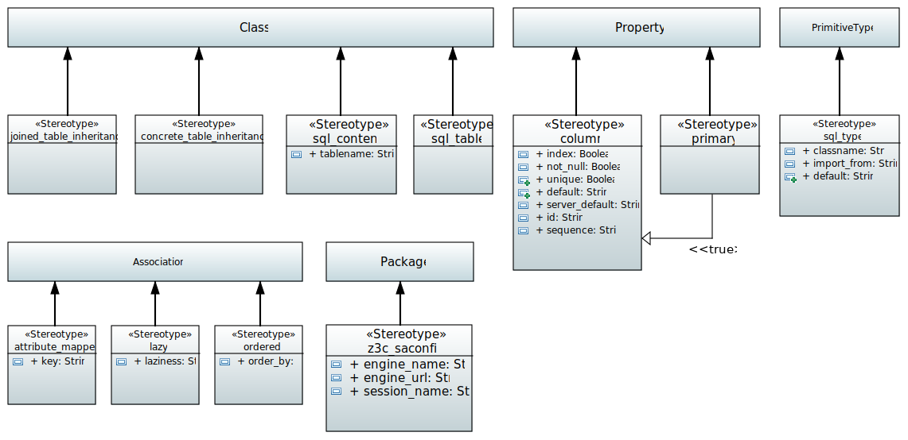

.. _profile_sql:

=================
UML:Profile sql
=================

Overview
---------

This document describes the UML profile for SQL.

.. list-table:: List of Stereotypes
   :widths: 55 20 25
   :header-rows: 1

   * - UML:Stereotype
     - Metaclasses
     - Tagged Values
   * - name of stereotype with link to details
     - applicable to
     - inherited and **new**
   * - :ref:`st_sqlcontent`
     - UML:Class
     - None
   * - :ref:`st_sql_table`
     - UML:Class
     - None
   * - :ref:`st_sql_concrete_table_inheritance`
     - UML:Class
     - None
   * - :ref:`st_joined_table_inheritance`
     - UML:Class
     - None
   * - :ref:`st_column`
     - UML:Property
     - index, not_null, unique, default, server_default
   * - :ref:`st_primary`
     - UML:Property
     - None
   * - :ref:`st_sql_type`
     - UML:PrimitiveType
     - None
   * - :ref:`st_z3c_saconfig`
     - UML:Package
     - engine_name, engine_url, session_name
   * - :ref:`st_attribute_mapped`
     - UML:Association
     - key
   * - :ref:`st_lazy`
     - UML:Association
     - laziness
   * - :ref:`_ordered`
     - UML:Association
     - order_by

.. _st_sqlcontent:

UML:Stereotype <<sql_content>>
-------------------------------

Metaclasses
~~~~~~~~~~~~
- UML:Class

Tagged Values
~~~~~~~~~~~~~~

**None**

.. _st_sql_table:

UML:Stereotype <<sql_table>>
-----------------------------

Metaclasses
~~~~~~~~~~~~
- UML:Class

Tagged Values
~~~~~~~~~~~~~~

**None**

.. _st_sql_concrete_table_inheritance:

UML:Stereotype <<sql_concrete_table_inheritance>>
--------------------------------------------------

Metaclasses
~~~~~~~~~~~~
- UML:Class

Tagged Values
~~~~~~~~~~~~~~

**None**

.. _st_joined_table_inheritance:

UML:Stereotype <<joined_table_inheritance>>
--------------------------------------------

Metaclasses
~~~~~~~~~~~~
- UML:Class

Tagged Values
~~~~~~~~~~~~~~

**None**

.. _st_column:

UML:Stereotype <<column>>
--------------------------

Metaclasses
~~~~~~~~~~~~
- UML:Property

Tagged Values
~~~~~~~~~~~~~~

**index**
    Boolean

**not_null**
    Boolean

**unique**
    Boolean

**default**
    String

**server_default**
    String

.. _st_primary:

UML:Stereotype <<primary>>
---------------------------

Special type of <<column>>

Metaclasses
~~~~~~~~~~~~
- UML:Property

Tagged Values
~~~~~~~~~~~~~~

**None**

.. _st_sql_type:

UML:Stereotype <<sql_type>>
----------------------------

Metaclasses
~~~~~~~~~~~~
- UML:PrimitiveType

Tagged Values
~~~~~~~~~~~~~~

**classname**
    String

**import_from**
    String

**default**
    String

.. _st_z3c_saconfig:

UML:Stereotype <<z3c_saconfig>>
--------------------------------

Metaclasses
~~~~~~~~~~~~
- UML:Package

Tagged Values
~~~~~~~~~~~~~~

**engine_name**
    String

**engine_url**
    String

**session_name**
    String

.. _st_attribute_mapped:

UML:Stereotype <<attribute_maped>>
-----------------------------------

Metaclasses
~~~~~~~~~~~~
- UML:Association

Tagged Values
~~~~~~~~~~~~~~

**key**
    String

.. _st_lazy:

UML:Stereotype <<lazy>>
------------------------

Metaclasses
~~~~~~~~~~~~
- UML:Association

Tagged Values
~~~~~~~~~~~~~~

**laziness**
    String

.. _st_ordered:

UML:Stereotype <<ordered>>
---------------------------

Metaclasses
~~~~~~~~~~~~
- UML:Association

Tagged Values
~~~~~~~~~~~~~~

**order_by**
    String

