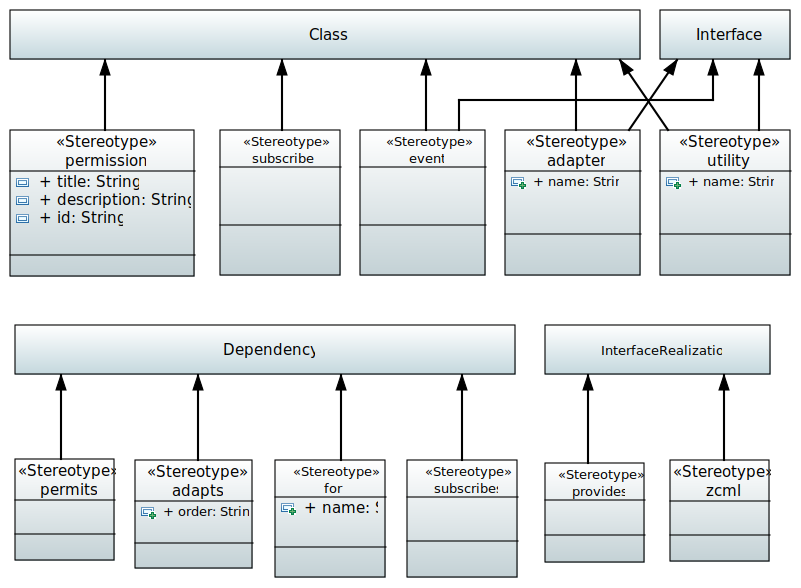

.. _profile_zca:

================
UML:Profile zca
================

Overview
---------

This document describes the **ZCA** UML profile.

UML:Stereotype <<permission>>
------------------------------

Permission settings. 

Metaclasses
~~~~~~~~~~~~

- UML:Class

Tagged Values
~~~~~~~~~~~~~~

**title**
    Name of permission.

**description**
    Description of permission.

**id**
    Id of permission.

UML:Stereotype <<subscriber>>
------------------------------

Metaclasses
~~~~~~~~~~~~

- UML:Class

Tagged Values
~~~~~~~~~~~~~~

**None**

UML:Stereotype <<event>>
-------------------------

Metaclasses
~~~~~~~~~~~~

- UML:Class
- UML:Interface

Tagged Values
~~~~~~~~~~~~~~

**None**

UML:Stereotype <<adapter>>
---------------------------

Metaclasses
~~~~~~~~~~~~

- UML:Class
- UML:Interface

Tagged Values
~~~~~~~~~~~~~~

**name**
    String: name of the adapter.

UML:Stereotype <<utility>>
---------------------------

Utilities modelled as Classes with outgoing dependencies (with the <<provides>>
stereotype) to some interface.

Metaclasses
~~~~~~~~~~~~

- UML:Class
- UML:Interface

Tagged Values
~~~~~~~~~~~~~~

**name**
    String: a name for it.

UML:Stereotype <<adapts>>
--------------------------

Draw a dependency from an **Adapter** to an adapted class or interface.

Metaclasses
~~~~~~~~~~~~

- UML:Dependency

Tagged Values
~~~~~~~~~~~~~~

**order**
    String: the order of adaption.

UML:Stereotype <<permits>>
---------------------------

Dependency between **Adapter** and a **Permission**.

Metaclasses
~~~~~~~~~~~~

- UML:Dependency

Tagged Values
~~~~~~~~~~~~~~

**None**

UML:Stereotype <<for>>
-----------------------

Metaclasses
~~~~~~~~~~~~

- UML:Dependency

Tagged Values
~~~~~~~~~~~~~~

**None**

UML:Stereotype <<subscribes>>
------------------------------

Metaclasses
~~~~~~~~~~~~

- UML:Dependency

Tagged Values
~~~~~~~~~~~~~~

**None**

UML:Stereotype <<provides>>
----------------------------

Metaclasses
~~~~~~~~~~~~

- UML:InterfaceRealization

Tagged Values
~~~~~~~~~~~~~~

**None**

UML:Stereotype <<zcml>>
------------------------

Metaclasses
~~~~~~~~~~~~

- UML:InterfaceRealization

Tagged Values
~~~~~~~~~~~~~~

**None**

