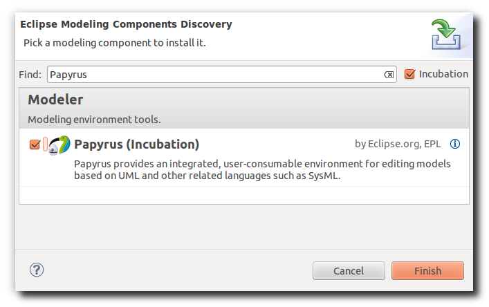
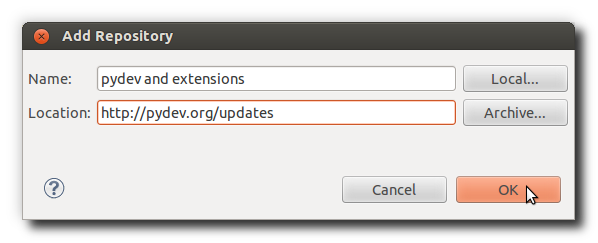
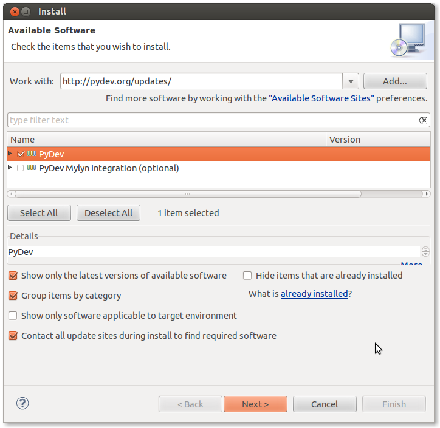
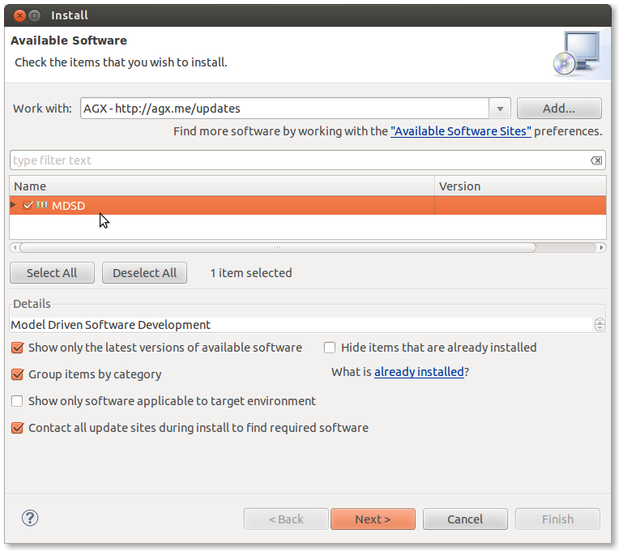

=====================================================
Installing and configuring Eclipse for use with AGX
=====================================================

These are installation instructions for using the Eclipse IDE for development.
Currenty AGX requires the **Modelling Edition** of **Eclipse Juno** (4.2).

Install Eclipse
---------------

Make sure to have an appropriate Java-interpreter on your machine.
Ubuntu users can simply::

    sudo apt-get install openjdk-7-jdk

Download and install the **Juno** Eclipse Modeling Tools bundle suitable for
your operating system from the
`download page <http://www.eclipse.org/downloads/packages/eclipse-modeling-tools/junosr1>`_.

.. note:: The screenshots on this page were made with Eclipse Indigo so they
          might look a little different from what you see in Eclipse Juno.

.. note:: Models created with Eclipse Indigo and the related version of Papyrus
          will work with Eclipse Juno and the related Papyrus,
          so there is **forward compatibility** (keep fingers crossed),
          but there is **no backward compatibility**:
          models created with a more recent version cannot be used with the older version,
	  due to some changes in the underlying machinery.

Unpack the downloaded ZIP or tarball to a location of your choice. Eclipse
should run if Java was installed properly by executing the eclipse binary::

    /eclipse/install/path/eclipse

.. note::
    Note for GTK Users (Gnome i.e.) - There is a bug in some older versions of
    GTK that causes certain print backends to hang. Fix it by providing a
    2-liner script as eclipse launcher::

        #!/bin/sh
        export GDK_NATIVE_WINDOWS=1
        /eclipse/install/path/eclipse -vmargs -XX:+AggressiveHeap

On first startup, eclipse asks you for a workspace location. This is the
location where your eclipse projects live.

After defining the workspace the eclipse welcome screen comes up. Go ahead and
dig around a little bit or go directly to the workbench (icon on the 
right).

Install Papyrus
---------------

Eclipse Modeling Tools come along with facilities for drawing UML models.
Anyway we'll use Papyrus for modeling, it's one of the shipped tools.

Use Eclipses menu and find ``Help --> Install Modeling Components``,
search for Papyrus and install it. 

Install PyDev
-------------

PyDev is an Eclipse plugin for Python development.

To install PyDev, use Eclipses menu and find ``Help --> Install New Software``,
click ``add`` button, enter ``PyDev`` as name and the location
``http://pydev.org/updates/`` to search for the plugin.

Select the ``PyDev`` plugin from available software, click ``install`` and follow
the install procedure.

Install AGX Eclipse plugin
--------------------------

AGX ships with an Eclipse plugin for invoking the generator via the IDE.

To install the AGX Eclipse plugin, repeat the procedure as shown in
``Install PyDev``, using ``AGX`` as name and ``http://agx.me/updates`` as
plugin location when adding the AGX update site.

.. note::
    The AGX plugin requires both Papyrus and PyDev in order to install and
    run correctly.

Configure AGX Eclipse plugin
----------------------------

Open your Eclipse Preferences, select the AGX section and select the AGX binary 
within bin directory of the agx.dev buildout.

Unrelated but useful plugins for development with Eclipse
---------------------------------------------------------

Eclipse Web Tools
~~~~~~~~~~~~~~~~~

* `Homepage <http://eclipse.org/webtools/>`_.

* Update Site: http://download.eclipse.org/releases/juno/
  (default update site for juno)

The eclipse web tools project contains lots of plugins, the most interresting
ones might be in category
``Web, XML, Java EE, and OSGi Enterprise Development``:

* Eclipse Web Developer Tools

* Eclipse XML Editors and Tools

* JavaScript Developer Tools

ReST Editor
~~~~~~~~~~~

An Eclipse plug-in providing support to edit reStructuredText files.

* `Homepage <http://resteditor.sourceforge.net/>`_.

* Update Sites: http://eclipse-color-theme.github.com/update and
  http://resteditor.sourceforge.net/eclipse

* Even easier: find it in the marketplace. Click Install. Go.

YAML Editor
~~~~~~~~~~~

An Eclipse plug-in providing support to edit YAML files.

* `Homepage <http://code.google.com/p/yedit/>`_.

* Update Site: http://dadacoalition.org/yedit
