=============================
Hello World - The first Model
=============================

Creating the first model and generating code using Eclipse.

Create a project
================

Assuming **PyDev** is installed, select **PyDev** perspective, click
**File** in main menu and select **new** -> **Pydev Project**.

Enter desired name, commonly the egg name, and click **finish**

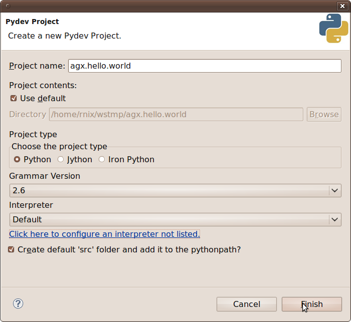

Create a new folder named **agx** inside new project by right clicking
on the project in navigator and selecting **new** -> **Folder**.

Create the model
================

Open the Papyrus perspective and navigate to the newly generated**agx** folder.

Create a new model by right clicking the folder in the navigator and selecting
**new** -> **create an empty Model**. Select the target folder and enter a name
for the model. finally click **finish**.

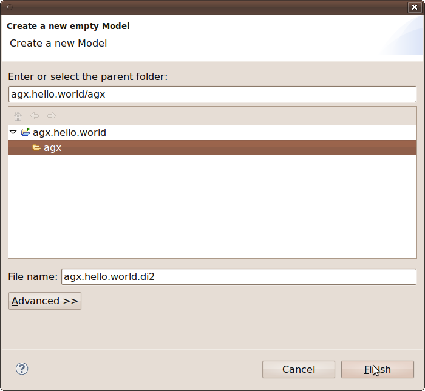

Two files are created. The diagram file and a UML file. After refreshing they
appear in the **navigator**.

.. image:: ../_static/hello_world_navigator.png

Open **outline** view by clicking **Window** and selecting **Show View** ->
**Outline**.

.. image:: ../_static/hello_world_outline.png

The UML model related toolbar can be expanded at the top right.

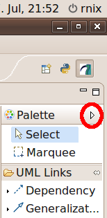

Configure AGX
=============

Right click on the already created **uml** file, select **Properties** and navigate
to **AGX Properties**.

Define the output directory. This is where generated code will be written to.

Define the generator executable. By clicking **apply** AGX Eclipse will fetch
the profiles to be provided by invoking the defined executable (./bin/agx -l, see Pre-Requirements).

Select the **pydev** profile, and activate it by selecting it and clicking **>>**.

Click **import selected profiles**. The selected profiles are now copied
to the location of the UML model. (Click F5 to refresh the project explorer view.)

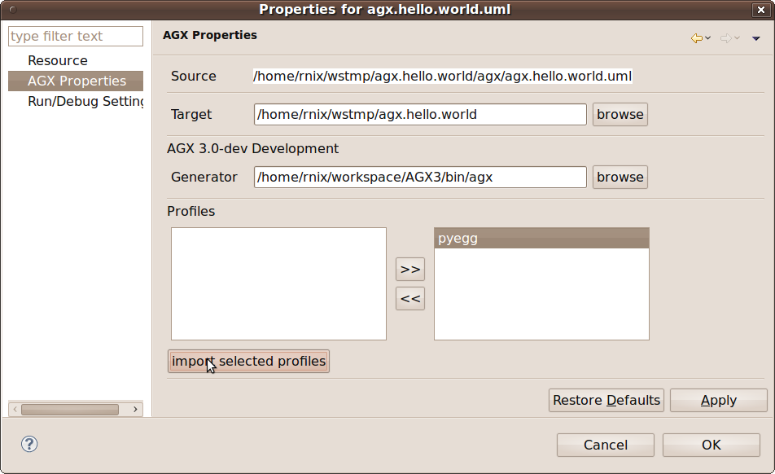

The dialogue in the bottom window will display a message.

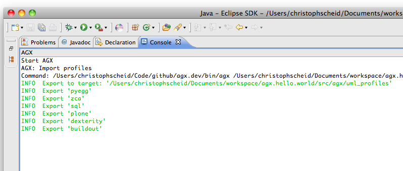

After refreshing the navigator shows the imported profile next to model. Keep
in mind that it is essential to have the model and profile(s) in the same folder.
That is because the path to profile is stored in model.

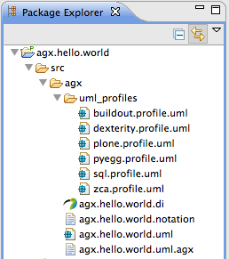

Apply profile(s) on model
=========================

Select (by double-clicking) the model in outline (in Helios: project explorer).

Click on the **Properties** tab at the bottom of the Eclipse IDE and click on the contained **Profiles** tab.

On the right you find the **+** icon for applying profiles.

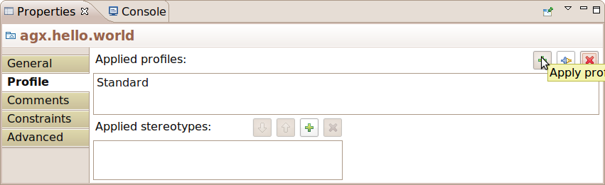

Click the **+** icon, navigate to **pyegg.profile.uml** in **agx** folder, select it
and click **OK**.

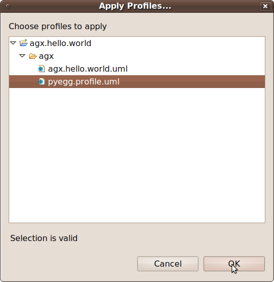

Choose **pyegg** profile, click **OK** and save model (**ctrl + s**)

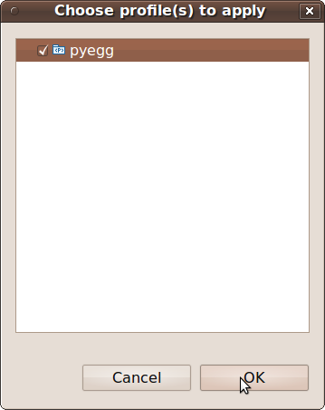

Creating a UML package for a python egg
=======================================

In this example we just draw a package generating the structure of a python egg.
The remaining profiles and generators are described in **Users Documentation**.

Expand the **Palette**, click *Package** and paint a package in your diagram.

If you have Helios with Papyrus, you can also use the tooltip that will appear
when hovering over the diagrams canvas and choose the symbol for package.

Click **Properties** Tab -> **General** and give it the desired egg name. This must
be a target package name, preceding names define the namespace packages.

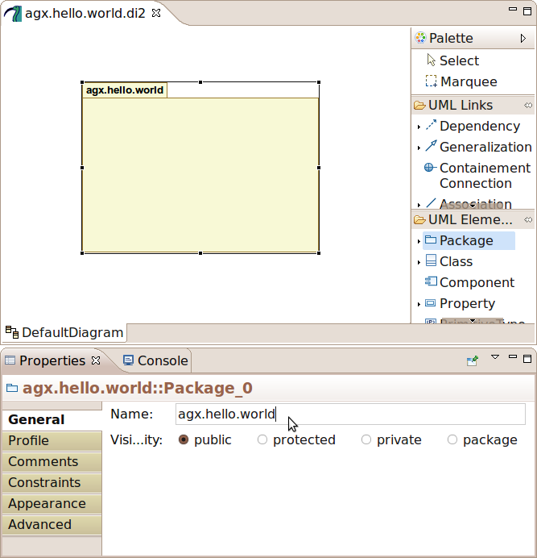

Apply pyegg stereotype on package
=================================

Right-click the package in the diagram and select **profile** -> **Apply Stereotype**.

Select **pyegg** profile, click **->** and **OK**.

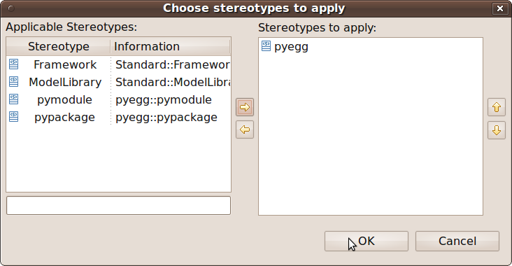

**pyegg** stereotype now apears to be set on package.

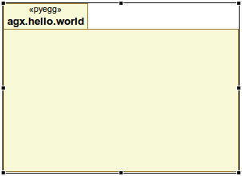

Set the tagged values for the pyegg stereotype
==============================================

Select the package. In the **Properties** view select the **Profile** tab. In **Applied stereotypes**
expand the **pyegg** section.

Now the available tagged values appear for the defined stereotype. Select the tagged value
name you want to define a value for and click the **+** button on the right to add a
value.

UML2 does not support multi valued tagged values. In case where enumerations
are needed, value is seperated by comma. Refer to **Users Documentation** for
details.

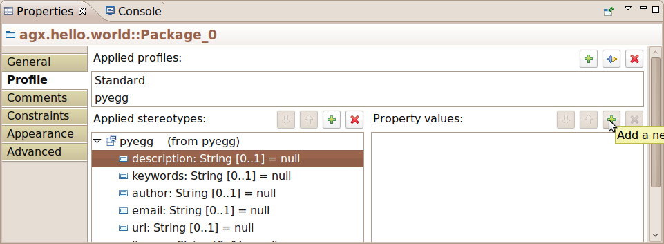

Save changes after defining tagged values.

Invoking AGX
============

The Model is now ready to be generated. Right-click the diagram related UML file
**agx.hello.world.uml** in the navigator and select **AGX** -> **generate**.

AGX opens a console and prints generator output to it.

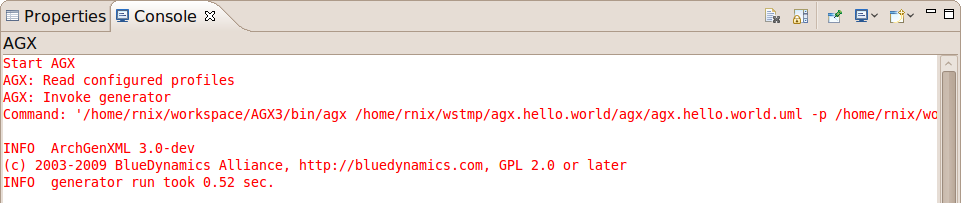

After refreshing generated code appears in navigator.

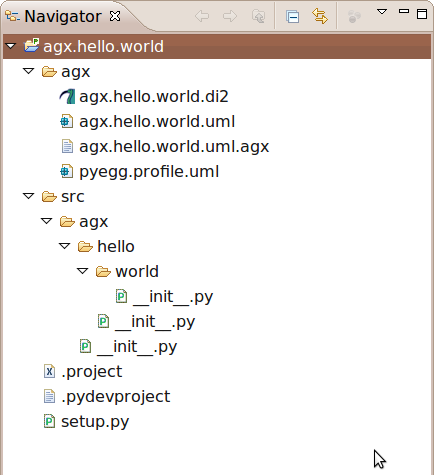

Congratulations. You have done your first AGX MDSD project.
