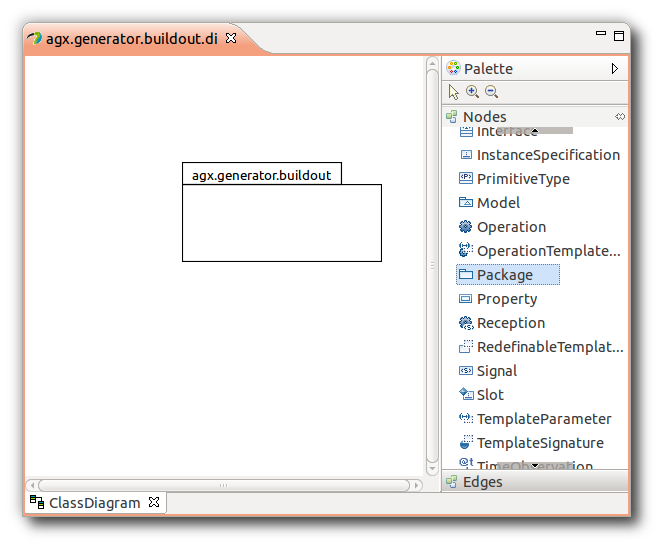
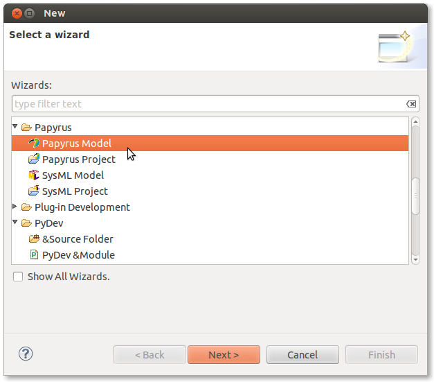
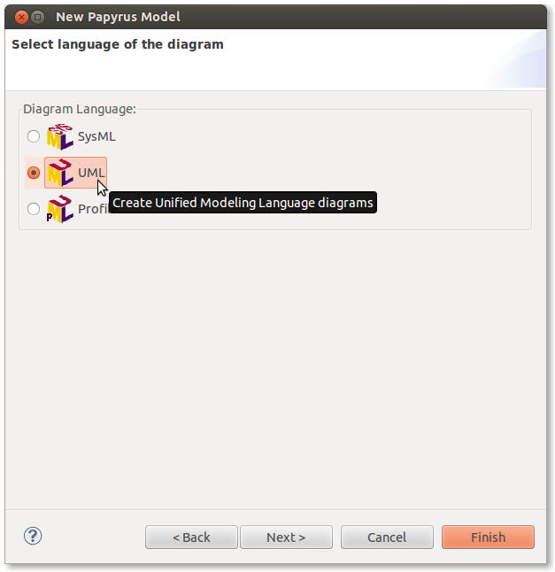
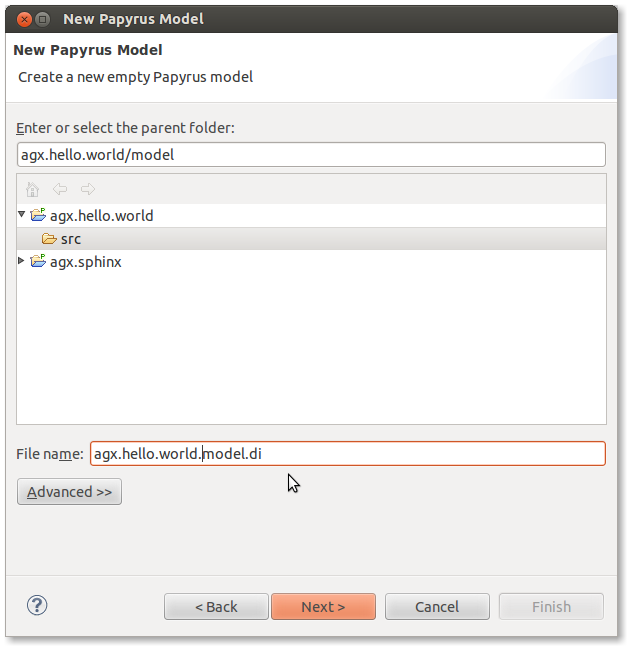
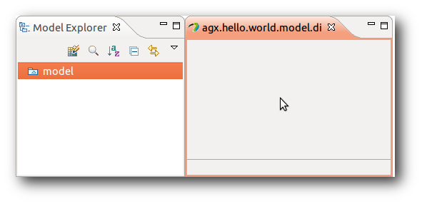

=============================
Hello World - The first Model
=============================

Motivation
----------

Now we create a first model and generate code.

Even some early versions of the agx. family of packages were made with
the same toolchain: using Eclipse & Papyrus for modeling and agx as generator.

Look at this model. It was used to generate the package structure (python egg)
of agx.generator.buildout.

But first...

Create a Pydev Project
======================

Open the  **PyDev** perspective, then click **File** in main menu and
select **new** -> **Pydev Project**.

You can also right-click the white space in the Package Explorer and choose 
**New** -> **Pydev Project**.

Enter the desired projectname name, possibly the desired egg name, 
and click **Finish**

.. image:: ../_static/helloworld_indigo_new_project_pydev.png
   :scale: 50%

When asked, choose Python 2.6 (Ubuntu: deadsnakes, remember?)

.. image:: ../_static/helloworld_indigo_new_project_pydev_name_grammar2_6.png
   :scale: 50%

Create the model
================

Open the **Papyrus** perspective and navigate to the created project.

Create a new model by right clicking the project in the navigator and selecting
**new** -> **create an empty Model**.

Choose **UML** for diagram language

Select the **target folder** and give the model a **Name**. *model.di* will do.

Finally click **finish**.

As of now the name does not influence any generator or generated features.

.. image:: ../_static/helloworld_indigo_select_new_agx_model.png
   :scale: 50%

Choose from the templates.

.. image:: ../_static/helloworld_indigo_new_model_select_template.png
   :scale: 50%

The result will be an empty model.

Two files are created. The diagram file and a UML file. After refreshing they
appear in the **navigator**.

.. image:: ../_static/hello_world_navigator.png
   :scale: 50%

Open **outline** view by clicking **Window** and selecting **Show View** ->
  **Outline**.

.. image:: ../_static/hello_world_outline.png
   :scale: 50%

The UML model related toolbar can be expanded at the top right.

.. image:: ../_static/hello_world_uml_toolbar.png
   :scale: 50%

Configure AGX
=============

Right click on the already created **uml** file, select **Properties** and navigate
to **AGX Properties**.

Define the output directory (**Default Generation Target**).
This is where generated code will be written to.

.. image:: ../_static/helloworld_indigo_agx_preferences.png

Define the generator executable. By clicking **apply** AGX Eclipse will fetch
the profiles to be provided by invoking the defined executable (./bin/agx -l, see Pre-Requirements).

Select the **pydev** profile, and activate it by selecting it and clicking **>>**.

Click **import selected profiles**. The selected profiles are now copied
to the location of the UML model. (Click F5 to refresh the project explorer view.)

.. image:: ../_static/hello_world_agx_properties.png

The dialogue in the bottom window will display a message.

.. image:: ../_static/hello_world_import_profile_receipt.png

After refreshing the navigator shows the imported profile next to model. Keep
in mind that it is essential to have the model and profile(s) in the same folder.
That is because the path to profile is stored in model.

.. image:: ../_static/hello_world_import_profiles.png

Apply Profile(s) on the Model
=============================

Select (by double-clicking) the model in outline view (since Helios: project explorer view).

Click on the **Properties** tab at the bottom of the Eclipse IDE and click on the contained **Profiles** tab.

On the right you find the **+** icon for applying profiles.

.. image:: ../_static/hello_world_apply_profile.png

Click the **+** icon, navigate to **pyegg.profile.uml** in **agx** folder, select it
and click **OK**.

.. image:: ../_static/hello_world_select_profile_to_apply.png

Choose **pyegg** profile, click **OK** and save model (**ctrl + s**)

.. image:: ../_static/hello_world_choose_profiles.png

Generate
========

.. image:: ../_static/eclipse_indigo_agx_generate.png

Creating a UML package for a python egg
=======================================

In this example we just draw a package generating the structure of a python egg.
The remaining profiles and generators are described in **Users Documentation**.

Expand the **Palette**, click *Package** and paint a package in your diagram.

If you have Helios with Papyrus, you can also use the tooltip that will appear
when hovering over the diagrams canvas and choose the symbol for package.

Click **Properties** Tab -> **General** and give it the desired egg name. This must
be a target package name, preceding names define the namespace packages.

.. image:: ../_static/hello_world_create_package.png

Apply pyegg stereotype on package
=================================

Right-click the package in the diagram and select **profile** -> **Apply Stereotype**.

Select **pyegg** profile, click **->** and **OK**.

.. image:: ../_static/hello_world_select_stereotype.png

**pyegg** stereotype now apears to be set on package.

.. image:: ../_static/hello_world_package_with_pyegg_stereotype.png

Set the tagged values for the pyegg stereotype
==============================================

Select the package. In the **Properties** view select the **Profile** tab. In **Applied stereotypes**
expand the **pyegg** section.

Now the available tagged values appear for the defined stereotype. Select the tagged value
name you want to define a value for and click the **+** button on the right to add a
value.

UML2 does not support multi valued tagged values. In case where enumerations
are needed, value is seperated by comma. Refer to **Users Documentation** for
details.

.. image:: ../_static/hello_world_define_tagged_values.png

Save changes after defining tagged values.

Invoking AGX
============

The Model is now ready to be generated. Right-click the diagram related UML file
**agx.hello.world.uml** in the navigator and select **AGX** -> **generate**.

AGX opens a console and prints generator output to it.

.. image:: ../_static/hello_world_agx_console.png

After refreshing generated code appears in navigator.

.. image:: ../_static/hello_world_navigator_generated.png

Congratulations. You have done your first AGX MDSD project.
