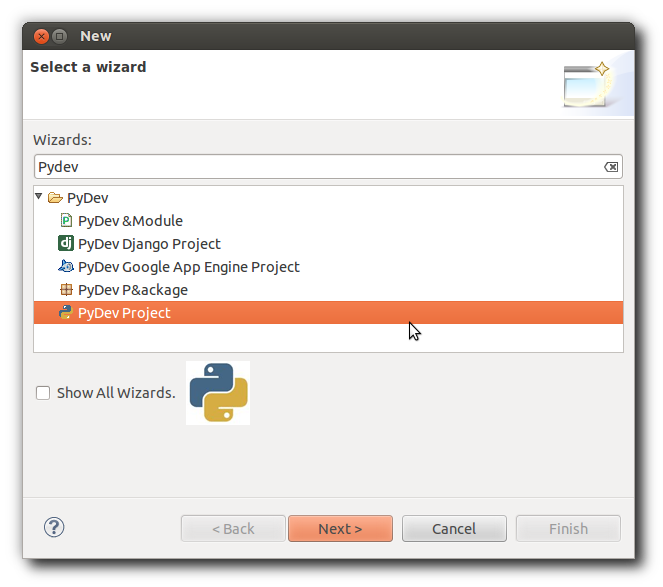
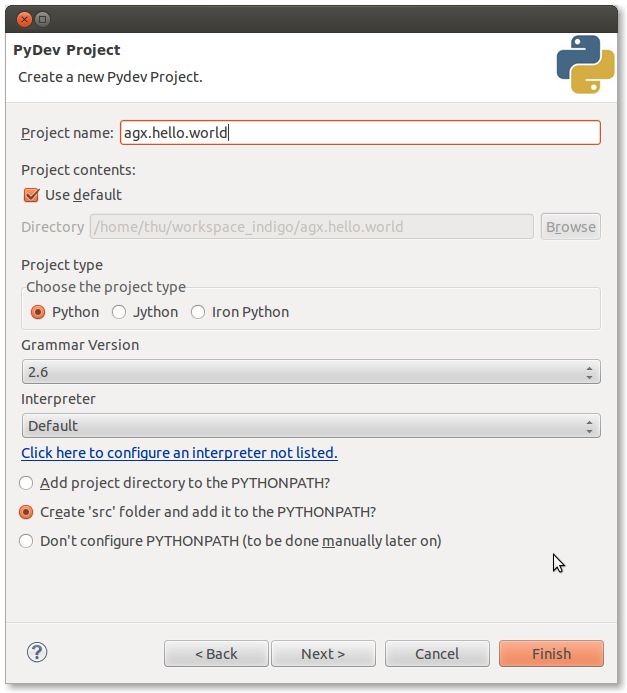
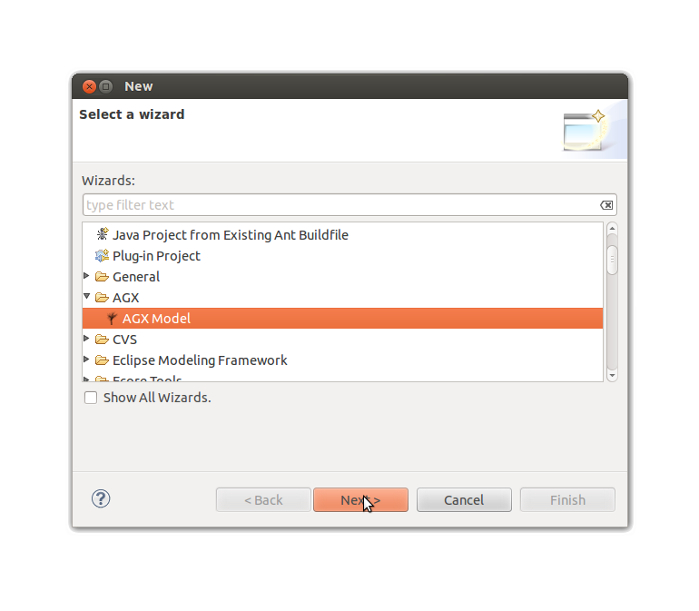
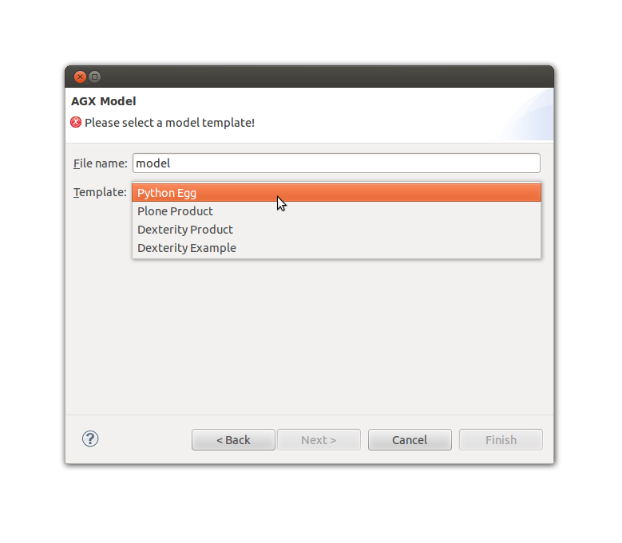
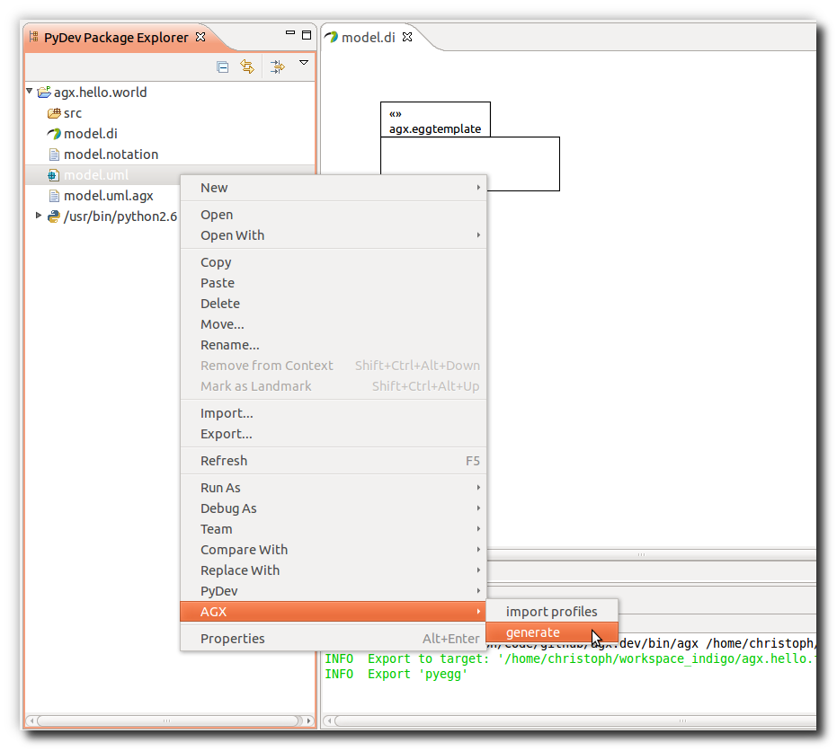
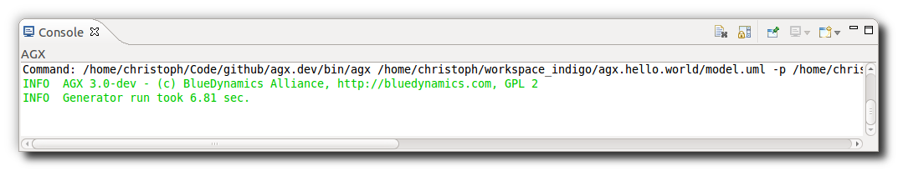
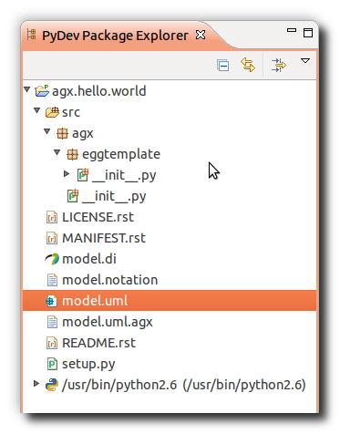
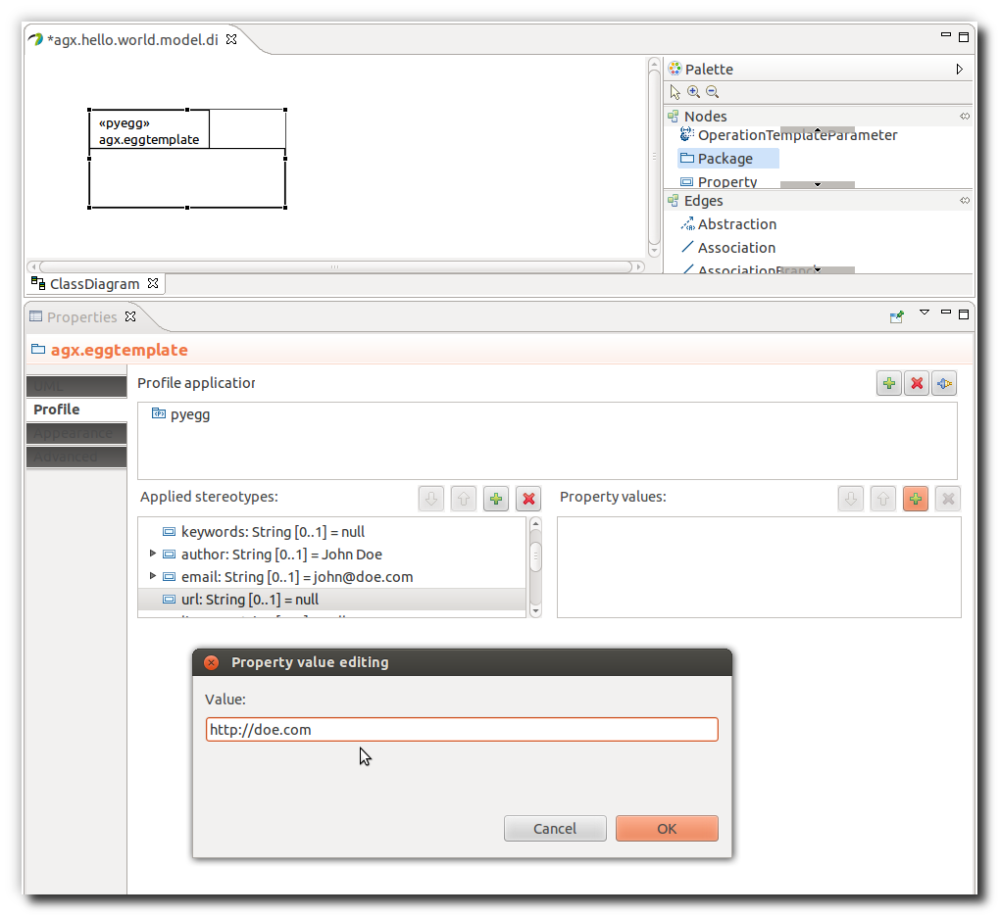

=============================
Hello World - The first Model
=============================

Motivation
==========

Now we create a first model and generate code.

Create a Pydev Project
----------------------

.. note:: The screenshots on this page were made with Eclipse Indigo so they
          might look a little different from what you see in Eclipse Juno.

Open the  **PyDev** perspective, then click **File** in main menu and
select **new** -> **Pydev Project**.

.. note:: You can find and create perspectives under menu Window -> Open Perspective

You can also right-click the white space in the Package Explorer and choose 
**New** -> **Pydev Project**.

Enter the desired projectname name, possibly the desired egg name, 
and click **Finish**

When asked, you may have to choose a Python version to be used. 
Both Python 2.6 and 2.7 will work. The dependency on 2.6 no longer exists.
You might have to tell Eclipse to auto-configure a Python interpreter,
if you have not done so before.

Create the model
----------------

Open the **Papyrus** perspective and navigate to the created project.

Create a new model by right clicking the project in the navigator and selecting
**New** -> **Other...** -> **AGX** -> **AGX Model**.

Give the model a **Name**: *model.di* (the default) will do. 

Choose from the templates. At the time of this writing there are templates for

* Python Egg
* Plone Product
* Dexterity Product
* Dexterity Example

For this Hello World, we will use the Python Egg template.

Finally click **finish**. Some files are created.
A diagram file (*model.di*), a UML file (*model.uml*), a notation file 
(*model.notation*) and an agx file (*model.uml.agx*). 

Generate Code from the Model
----------------------------

Now you are ready to start the generator for the first time: 
Right-click the *model.uml* and select **AGX** -> **generate**.

In the Console you will see the generators output messages:

The package explorer will show the newly generated code:

Here you see a nested structure like in a namespace package. Naming the package
in the model in a way as in python namespaces will yield code in that kind of 
nested structure.

Setting tagged values for the pyegg stereotype
==============================================

Python eggs usually come with a file *setup.py* that holds setup instructions
and dependencies as well as metadata like author name and email. Those can be
included in the model (and thus the generated code) by adding them in so called
**tagged values**.

Open the model file (*.di*) using Eclipses **Papyrus perspective**. In the
**Properties** view select the **Profile** tab. In **Applied stereotypes**
expand the **pyegg** section.

Now the available tagged values appear for the defined stereotype. Select the tagged value
name you want to define a value for and click the **+** button on the right to add a
value.

UML2 does not support multi valued tagged values. In case where enumerations
are needed, value is separated by comma. Refer to **Users Documentation** for
details.

Save changes after defining tagged values. You also have to re-run the generator
for your changes to be reflected in the code.

Done!
-----

Congratulations. You have completed your first AGX MDSD project.
