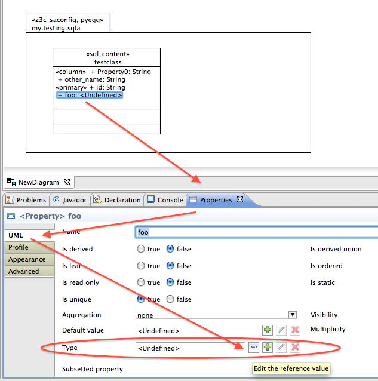
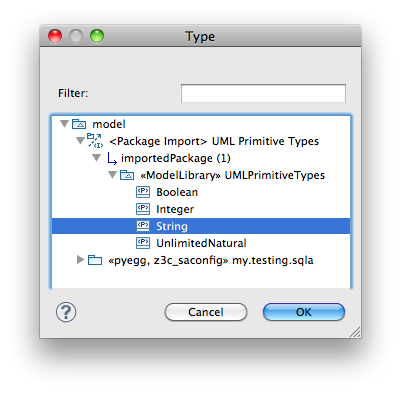

.. _basic_types:

Import and Use Basic Datatypes
-------------------------------

.. note:: When creating a new Papyrus diagram with the **New Papyrus Model** wizard,
          after choosing **UML** as language of the diagramm,
          you can activate the checkbox saying
	  **A UML model with basic primitive types (ModelWithBasicTypes)**. 
	  This is a valid workaround for omitting the problems detailed in this section.

Import
~~~~~~~
If you want to use standard data types like **Boolean**, **Integer**, **String**
or **UnlimitedNatural** in your model as datatypes of *Properties* (i.e. attributes)
in **sql_content** classes, you need to import the standard data types into your model.

Change to the **Papyrus Perspective** and look at the **Model Explorer**.
The topmost node is called **model**. Right-click it and select
**Import package from registered library**.

Choose **UMLPrimitiveTypes** and confirm with **OK**.
The standard data types will now be available throughout the model.

Use
~~~~
When modelling classes with stereotype **sql_content** you have to choose a
data type for each property (aka attribute). If there is no datatype attached,
AGX will barf:
::

 Start AGX
 AGX: Read configured profiles
 AGX: Invoke generator
 Command: /Users/christophscheid/Documents/workspace/agx.dev/bin/agx /Users/christophscheid/Documents/workspace/sqla.testing/sqla.model.uml -p /Users/christophscheid/Documents/workspace/agx.dev/devsrc/agx.generator.pyegg/src/agx/generator/pyegg/profiles/pyegg.profile.uml,/Users/christophscheid/Documents/workspace/agx.dev/devsrc/agx.generator.sql/src/agx/generator/sql/profiles/sql.profile.uml -o /Users/christophscheid/Documents/workspace/sqla.testing
 INFO  AGX 3.0-dev - (c) BlueDynamics Alliance, http://bluedynamics.com, GPL 2
 Traceback (most recent call last):
   File "/Users/christophscheid/Documents/workspace/agx.dev/bin/agx", line 50, in <module>
     sys.exit(agx.dev.main.run())
   File "/Users/christophscheid/Documents/workspace/agx.dev/src/agx/dev/main.py", line 15, in run
     agx.core.main.run()
   ...
   File "/Users/christophscheid/Documents/workspace/agx.dev/devsrc/agx.core/src/agx/core/_api.py", line 299, in __call__
     self._callfunc(self, source, target)
   File "/Users/christophscheid/Documents/workspace/agx.dev/devsrc/agx.generator.uml/src/agx/generator/uml/datatypedependent.py",  line 57, in property
     (source.element.get('name'),source.parent.element.get('name'))
 ValueError: Property "foo" in class "testclass" has no datatype!

So when adding a property, it has type *<Undefined>* by default.
To change it to be a **String** (or **Integer**, **Boolean**, ...) go to the
**Properties** window, select tab **UML**, and under **Type** (where it states
`<Undefined>` klick on the button with the three dots.

A window will pop up. Open the tree until you find the relevant type.

