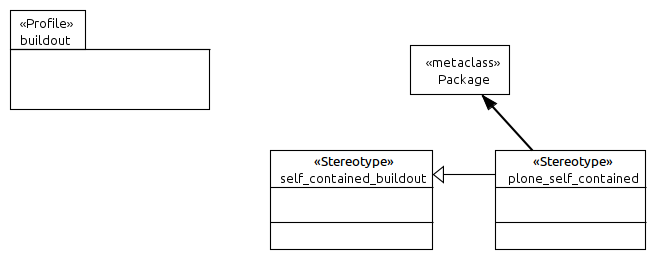

====================
UML:Profile buildout
====================

Create a working setup for **buildout**.

Buildout is a software build system, the Python equivalent of Make, Maven and
the like, enabling repeatable setups: bootstrap self-contained installations
with dependencies and configuration.
See `<http://www.buildout.org/>`_.

Overview
--------

**buildout** UML profile overview.

UML:Stereotype <<self_contained_buildout>>
------------------------------------------

Stereotype description

Metaclasses
~~~~~~~~~~~

- UML:Package

Tagged Values
~~~~~~~~~~~~~

**None**

UML:Stereotype <<plone_self_contained>>
---------------------------------------

Stereotype description

Metaclasses
~~~~~~~~~~~

- UML:Package

Tagged Values
~~~~~~~~~~~~~

**None**
