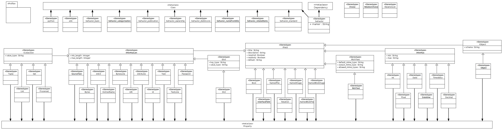
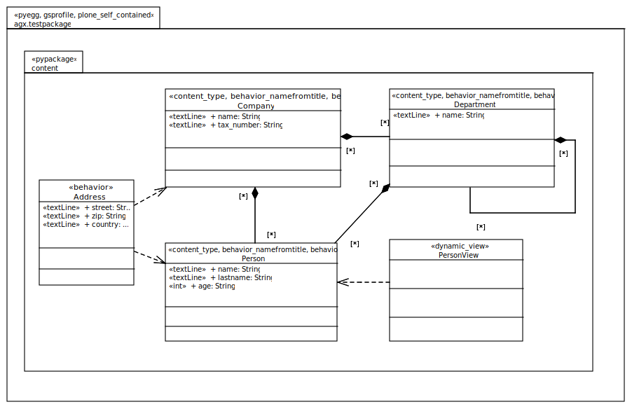

======================
UML:Profile dexterity
======================

This document describes the AGX Dexterity UML profile.

Overview
---------

As can be seen in the image above, there are several stereotypes available
in the dexterity profile.

See the
`Dexterity Developer Manual <http://dexterity-developer-manual.readthedocs.org/>`_
for a reference on dexterity.

The dexterity profile has roughly two types of stereotypes:

**behavioral**

  (upper half of profile)

  can be applied on UML classes (and dependencies respectively)
  and denote some dexterity behaviour.

  see `Dexterity Developer Manual: Standard behaviours
  <http://dexterity-developer-manual.readthedocs.org/en/latest/reference/standard-behaviours.html>`_

**field properties**

  (lower half)

  applicable to fields in dexterity
  content types (i.e. form fields) and can be attached to UML properties only.

  see `Dexterity Developer Manual: Fields
  <http://dexterity-developer-manual.readthedocs.org/en/latest/reference/fields.html>`_

Note however, that some are directly usable and
applicable on your UML objects, while others are not.

The latter (usually named starting with a capital **I** for Interface,
e.g. IField, IMinMaxLen, ICollection)
are part of an inheritance hierarchy.
Their tagged values are handed down the inheritance hierarchy to those
stereotypes that are actually applicable on UML elements,
e.g. Text, TextLine, Password, etc.

.. list-table:: List of Stereotypes
   :widths: 55 20 25
   :header-rows: 1

   * - UML:Stereotype
     - Metaclasses
     - Tagged Values
   * - name of stereotype
     - applicable to
     - inherited and **new**
   * - :ref:`st_python`
     - UML:Class
     - None
   * - :ref:`st_xml`
     - UML:Class
     - None
   * - :ref:`st_behaviour_basic`
     - UML:Class
     - None
   * - :ref:`st_behaviour_categorization`
     - UML:Class
     - None
   * - :ref:`st_behaviour_publication`
     - UML:Class
     - None
   * - :ref:`st_behaviour_ownership`
     - UML:Class
     - None
   * - :ref:`st_behaviour_dublincore`
     - UML:Class
     - None
   * - :ref:`st_behaviour_namefromtitle`
     - UML:Class
     - None
   * - :ref:`st_behaviour_relateditems`
     - UML:Class
     - None
   * - :ref:`st_behaviour_standard`
     - UML:Class
     - None
   * - :ref:`st_behaviour`
     - UML:Class, UML:Dependency
     - **marker**
   * - .
     - .
     - .

.. list-table:: **List of Stereotypes not implemented**
   :widths: 45 10 20 25
   :header-rows: 1

   * - UML:Stereotype
     - Metaclasses
     - Tagged Values
     - **Note**
   * - :ref:`st_Choice`
     - n/a
     - n/a
     - **not implemented**
   * - :ref:`st_RelationChoice`
     - n/a
     - n/a
     - **not implemented**
   * - :ref:`st_RelationList`
     - n/a
     - n/a
     - **not implemented**
   * - .
     - .
     - .
     - .

.. list-table:: List of **Stereotypes for Fields (form items)** and their relevant hierarchy; tagged values in **bold** are handed down the inheritance hierarchy.
   :widths: 45 10 45
   :header-rows: 1

   * - UML:Stereotype
     - Metaclasses
     - Tagged Values
   * - name of stereotype
     - applicable to
     - inherited and **new**
   * - :ref:`st_IField`
     - n/a
     - **title, description, required, readonly, default**
   * - :ref:`st_IMinMaxLen`
     - n/a
     - title, description, required, readonly, default, **min_length, max_length**
   * - :ref:`st_ICollection`
     - n/a
     - title, description, required, readonly, default, min_length, max_length, **value_type**
   * - :ref:`st_Tuple`
     - UML:Property
     - title, description, required, readonly, default, min_length, max_length, value_type
   * - :ref:`st_List`
     - UML:Property
     - title, description, required, readonly, default, min_length, max_length, value_type
   * - :ref:`st_Set`
     - UML:Property
     - title, description, required, readonly, default, min_length, max_length, value_type
   * - :ref:`st_Frozenset`
     - UML:Property
     - title, description, required, readonly, default, min_length, max_length, value_type
   * - .
     - .
     - .
   * - name of stereotype
     - applicable to
     - inherited and **new**
   * - :ref:`st_IField`
     - n/a
     - **title, description, required, readonly, default**
   * - :ref:`st_IMinMaxLen`
     - n/a
     - title, description, required, readonly, default, **min_length, max_length**
   * - :ref:`st_SourceText`
     - UML:Property
     - title, description, required, readonly, default, min_length, max_length
   * - :ref:`st_Bytes`
     - UML:Property
     - title, description, required, readonly, default, min_length, max_length
   * - :ref:`st_ASCII`
     - UML:Property
     - title, description, required, readonly, default, min_length, max_length
   * - :ref:`st_DottedName`
     - UML:Property
     - title, description, required, readonly, default, min_length, max_length
   * - :ref:`st_BytesLine`
     - UML:Property
     - title, description, required, readonly, default, min_length, max_length
   * - :ref:`st_URI`
     - UML:Property
     - title, description, required, readonly, default, min_length, max_length
   * - :ref:`st_ASCIILine`
     - UML:Property
     - title, description, required, readonly, default, min_length, max_length
   * - :ref:`st_Id`
     - UML:Property
     - title, description, required, readonly, default, min_length, max_length
   * - :ref:`st_Text`
     - UML:Property
     - title, description, required, readonly, default, min_length, max_length
   * - :ref:`st_TextLine`
     - UML:Property
     - title, description, required, readonly, default, min_length, max_length
   * - :ref:`st_Password`
     - UML:Property
     - title, description, required, readonly, default, min_length, max_length
   * - .
     - .
     - .
   * - name of stereotype
     - applicable to
     - inherited and **new**
   * - :ref:`st_IField`
     - n/a
     - **title, description, required, readonly, default**
   * - :ref:`st_IMinMaxLen`
     - n/a
     - title, description, required, readonly, default, **min_length, max_length**
   * - :ref:`st_IDict`
     - n/a
     - title, description, required, readonly, default, min_length, max_length, **key_type, value_type**
   * - :ref:`st_Dict`
     - UML:Property
     - title, description, required, readonly, default, min_length, max_length, key_type, value_type
   * - .
     - .
     - .
   * - name of stereotype
     - applicable to
     - inherited and **new**
   * - :ref:`st_IField`
     - n/a
     - **title, description, required, readonly, default**
   * - :ref:`st_Bool`
     - UML:Property
     - title, description, required, readonly, default
   * - :ref:`st_InterfaceField`
     - UML:Property
     - title, description, required, readonly, default
   * - :ref:`st_NamedField`
     - UML:Property
     - title, description, required, readonly, default
   * - :ref:`st_Relation`
     - UML:Property
     - title, description, required, readonly, default
   * - :ref:`st_NamedImage`
     - UML:Property
     - title, description, required, readonly, default
   * - :ref:`st_NamedBlobFile`
     - UML:Property
     - title, description, required, readonly, default
   * - :ref:`st_NamedBlobImage`
     - UML:Property
     - title, description, required, readonly, default
   * - .
     - .
     - .
   * - name of stereotype
     - applicable to
     - inherited and **new**
   * - :ref:`st_IField`
     - n/a
     - **title, description, required, readonly, default**
   * - :ref:`st_IRichText`
     - n/a
     - title, description, required, readonly, default, **default_mime_type, output_mime_type, allowed_mime_types**
   * - :ref:`st_RichText`
     - UML:Property
     - title, description, required, readonly, default, default_mime_type, output_mime_type, allowed_mime_types
   * - .
     - .
     - .
   * - name of stereotype
     - applicable to
     - inherited and **new**
   * - :ref:`st_IField`
     - n/a
     - **title, description, required, readonly, default**
   * - :ref:`st_IMinMax`
     - n/a
     - title, description, required, readonly, default, **min, max**
   * - :ref:`st_Int`
     - UML:Property
     - title, description, required, readonly, default, min, max
   * - :ref:`st_Float`
     - UML:Property
     - title, description, required, readonly, default, min, max
   * - :ref:`st_Date`
     - UML:Property
     - title, description, required, readonly, default, min, max
   * - :ref:`st_Datetime`
     - UML:Property
     - title, description, required, readonly, default, min, max
   * - :ref:`st_Timedelta`
     - UML:Property
     - title, description, required, readonly, default, min, max
   * - :ref:`st_Decimal`
     - UML:Property
     - title, description, required, readonly, default, min, max
   * - .
     - .
     - .
   * - name of stereotype
     - applicable to
     - inherited and **new**
   * - :ref:`st_IField`
     - n/a
     - **title, description, required, readonly, default**
   * - :ref:`st_IObject`
     - n/a
     - title, description, required, readonly, default, **schema**
   * - :ref:`st_Object`
     - UML:Property
     - title, description, required, readonly, default, schema
   * - .
     - .
     - .

.. _st_python:

UML:Stereotype <<python>>
--------------------------

Metaclasses
~~~~~~~~~~~~
- UML:Class

Tagged Values**
~~~~~~~~~~~~~~~~
**None**

.. _st_xml:

UML:Stereotype <<xml>>
-----------------------

Metaclasses
~~~~~~~~~~~~
- UML:Class

Tagged Values**
~~~~~~~~~~~~~~~~

**None**: 

.. _st_behaviour_basic:

UML:Stereotype <<behaviour_basic>>
-----------------------------------

Metaclasses
~~~~~~~~~~~~
- UML:Class

Tagged Values**
~~~~~~~~~~~~~~~~
**None**: 

.. _st_behaviour_categorization:

UML:Stereotype <<behaviour_categorization>>
---------------------------------------------

Metaclasses
~~~~~~~~~~~~
- UML:Class

Tagged Values**
~~~~~~~~~~~~~~~~

**None**: 

.. _st_behaviour_publication:

UML:Stereotype <<behaviour_publication>>
------------------------------------------

Metaclasses
~~~~~~~~~~~~
- UML:Class

Tagged Values**
~~~~~~~~~~~~~~~~

**None**: 

.. _st_behaviour_ownership:

UML:Stereotype <<behaviour_ownership>>
----------------------------------------

Metaclasses
~~~~~~~~~~~~
- UML:Class

Tagged Values**
~~~~~~~~~~~~~~~~

**None**: 

.. _st_behaviour_dublincore:

UML:Stereotype <<behaviour_dublincore>>
-----------------------------------------

Metaclasses
~~~~~~~~~~~~
- UML:Class

Tagged Values**
~~~~~~~~~~~~~~~~

**None**: 

.. _st_behaviour_namefromtitle:

UML:Stereotype <<behaviour_namefromtitle>>
--------------------------------------------

Metaclasses
~~~~~~~~~~~~
- UML:Class

Tagged Values**
~~~~~~~~~~~~~~~~

**None**: 

.. _st_behaviour_relateditems:

UML:Stereotype <<behaviour_relateditems>>
-------------------------------------------

Metaclasses
~~~~~~~~~~~~
- UML:Class

Tagged Values**
~~~~~~~~~~~~~~~~

**None**: 

.. _st_behaviour_standard:

UML:Stereotype <<behaviour_standard>>
---------------------------------------

Metaclasses
~~~~~~~~~~~~
- UML:Class

Tagged Values**
~~~~~~~~~~~~~~~~

**None**: 

.. _st_behaviour:

UML:Stereotype <<behaviour>>
------------------------------

Metaclasses
~~~~~~~~~~~~
- UML:Class
- UML:Dependency

Tagged Values**
~~~~~~~~~~~~~~~~

**marker**: 
    String: marker name.

.. _st_Choice:

UML:Stereotype <<Choice>>
--------------------------
not implemented

Metaclasses
~~~~~~~~~~~~
**None**

Tagged Values**
~~~~~~~~~~~~~~~~

**None**

.. _st_RelationChoice:

UML:Stereotype <<RelationChoice>>
----------------------------------
not implemented

Metaclasses
~~~~~~~~~~~~
**None**

Tagged Values**
~~~~~~~~~~~~~~~~

**None**

.. _st_RelationList:

UML:Stereotype <<RelationList>>
--------------------------------
not implemented

Metaclasses
~~~~~~~~~~~~
**None**

Tagged Values**
~~~~~~~~~~~~~~~~

**None**

.. _st_ICollection:

UML:Stereotype <<ICollection>>
-------------------------------
Generalized interface class for Collections.
See the following four stereotypes for specializations.

Metaclasses
~~~~~~~~~~~~
- UML:Property

Tagged Values**
~~~~~~~~~~~~~~~~
**value_type**
    String: type of values in this collection.

.. _st_Tuple:

UML:Stereotype <<Tuple>>
-------------------------
Specialization of ICollection, see above.

Metaclasses
~~~~~~~~~~~~
- UML:Property

Tagged Values**
~~~~~~~~~~~~~~~~
**None**

.. _st_List:

UML:Stereotype <<List>>
------------------------
Specialization of ICollection, see above.

Metaclasses
~~~~~~~~~~~~
- UML:Property

Tagged Values**
~~~~~~~~~~~~~~~~
**None**

.. _st_Set:

UML:Stereotype <<Set>>
-----------------------
Specialization of ICollection, see above.

Metaclasses
~~~~~~~~~~~~
- UML:Property

Tagged Values**
~~~~~~~~~~~~~~~~
**None**

.. _st_Frozenset:

UML:Stereotype <<Frozenset>>
-----------------------------
Specialization of ICollection, see above.

Metaclasses
~~~~~~~~~~~~
- UML:Property

Tagged Values**
~~~~~~~~~~~~~~~~
**None**

.. _st_IMinMaxLen:

UML:Stereotype <<IMinMaxLength>>
---------------------------------
Generalized interface class for minimum and maximum length specifications.
See the following eleven stereotypes for specializations.

Metaclasses
~~~~~~~~~~~~
- UML:Property

Tagged Values**
~~~~~~~~~~~~~~~~
**min_length**
    Integer: the minimum length.

**max_length**
    Integer: the maximum length.

.. _st_SourceText:

UML:Stereotype <<SourceText>>
------------------------------
Specialization of IMinMaxLen, see above.

Metaclasses
~~~~~~~~~~~~
- UML:Property

Tagged Values**
~~~~~~~~~~~~~~~~
**None**

.. _st_Bytes:

UML:Stereotype <<Bytes>>
-------------------------
Specialization of IMinMaxLen, see above.

Metaclasses
~~~~~~~~~~~~
- UML:Property

Tagged Values**
~~~~~~~~~~~~~~~~
**None**

.. _st_ASCII:

UML:Stereotype <<ASCII>>
-------------------------
Specialization of IMinMaxLen, see above.

Metaclasses
~~~~~~~~~~~~
- UML:Property

Tagged Values**
~~~~~~~~~~~~~~~~
**None**

.. _st_DottedName:

UML:Stereotype <<DottedName>>
------------------------------
Specialization of IMinMaxLen, see above.

Metaclasses
~~~~~~~~~~~~
- UML:Property

Tagged Values**
~~~~~~~~~~~~~~~~
**None**

.. _st_BytesLine:

UML:Stereotype <<BytesLine>>
-----------------------------
Specialization of IMinMaxLen, see above.

Metaclasses
~~~~~~~~~~~~
- UML:Property

Tagged Values**
~~~~~~~~~~~~~~~~
**None**

.. _st_URI:

UML:Stereotype <<URI>>
-----------------------
Specialization of IMinMaxLen, see above.

Metaclasses
~~~~~~~~~~~~
- UML:Property

Tagged Values**
~~~~~~~~~~~~~~~~
**None**

.. _st_ASCIILine:

UML:Stereotype <<ASCIILine>>
-----------------------------
Specialization of IMinMaxLen, see above.

Metaclasses
~~~~~~~~~~~~
- UML:Property

Tagged Values**
~~~~~~~~~~~~~~~~
**None**

.. _st_Id:

UML:Stereotype <<Id>>
----------------------
Specialization of IMinMaxLen, see above.

Metaclasses
~~~~~~~~~~~~
- UML:Property

Tagged Values**
~~~~~~~~~~~~~~~~
**None**

.. _st_Text:

UML:Stereotype <<Text>>
------------------------
Specialization of IMinMaxLen, see above.

Metaclasses
~~~~~~~~~~~~
- UML:Property

Tagged Values**
~~~~~~~~~~~~~~~~
**None**

.. _st_TextLine:

UML:Stereotype <<TextLine>>
----------------------------
Specialization of IMinMaxLen, see above.

Metaclasses
~~~~~~~~~~~~
- UML:Property

Tagged Values**
~~~~~~~~~~~~~~~~
**None**

.. _st_Password:

UML:Stereotype <<Password>>
----------------------------
Specialization of IMinMaxLen, see above.

Metaclasses
~~~~~~~~~~~~
- UML:Property

Tagged Values**
~~~~~~~~~~~~~~~~
**None**

.. _st_IDict:

UML:Stereotype <<IDict>>
-------------------------
Generalized interface class for dictionaries.
See the following stereotype for specializations.

Metaclasses
~~~~~~~~~~~~
- UML:Property

Tagged Values**
~~~~~~~~~~~~~~~~
**key_type**
    String: the key type.

**value_type**
    String: the value type.

.. _st_Dict:

UML:Stereotype <<Dict>>
------------------------
Specialization of IDict, see above.

Metaclasses
~~~~~~~~~~~~
- UML:Property

Tagged Values**
~~~~~~~~~~~~~~~~
**None**

.. _st_IField:

UML:Stereotype <<IField>>
--------------------------
Generalized interface class for field types.
See the following stereotypes for specializations.

Metaclasses
~~~~~~~~~~~~
- UML:Property

Tagged Values**
~~~~~~~~~~~~~~~~
**title**
    String: the title.

**description**
    String: the descripton.

**required**
    Boolean: Is this field required?

**readonly**
   Boolean: may the value not be changed?

**default**
   String: the default content.

.. _st_Bool:

UML:Stereotype <<Bool>>
------------------------
Specialization of IField, see above.

Metaclasses
~~~~~~~~~~~~
- UML:Property

Tagged Values**
~~~~~~~~~~~~~~~~
**None**

.. _st_InterfaceField:

UML:Stereotype <<InterfaceField>>
----------------------------------
Specialization of IField, see above.

Metaclasses
~~~~~~~~~~~~
- UML:Property

Tagged Values**
~~~~~~~~~~~~~~~~
**None**

.. _st_NamedField:

UML:Stereotype <<NamedField>>
------------------------------
Specialization of IField, see above.

Metaclasses
~~~~~~~~~~~~
- UML:Property

Tagged Values**
~~~~~~~~~~~~~~~~
**None**

.. _st_Relation:

UML:Stereotype <<Relation>>
----------------------------
Relation with some other content.

Specialization of IField, see above.

Metaclasses
~~~~~~~~~~~~
- UML:Property

Tagged Values**
~~~~~~~~~~~~~~~~
**None**

.. _st_NamedImage:

UML:Stereotype <<NamedImage>>
------------------------------
Image with a name.

Specialization of IField, see above.

Metaclasses
~~~~~~~~~~~~
- UML:Property

Tagged Values**
~~~~~~~~~~~~~~~~
**None**

.. _st_NamedBlobFile:

UML:Stereotype <<NamedBlobFile>>
---------------------------------
File with a name.

Specialization of IField, see above.

Metaclasses
~~~~~~~~~~~~
- UML:Property

Tagged Values**
~~~~~~~~~~~~~~~~
**None**

.. _st_NamedBlobImage:

UML:Stereotype <<NamedBlobImage>>
----------------------------------
Named Image, to be stored outside the ZODB.

Specialization of IField, see above.

Metaclasses
~~~~~~~~~~~~
- UML:Property

Tagged Values**
~~~~~~~~~~~~~~~~
**None**

.. _st_IRichText:

UML:Stereotype <<IRichText>>
-----------------------------
Specialization of IField, see above.

Generalized interface class for RichText fields.
See the following stereotype for a specialization.

Metaclasses
~~~~~~~~~~~~
- UML:Property

Tagged Values**
~~~~~~~~~~~~~~~~
**default_mime_type**
    String: the default mime type.

**output_mime_type**
    String: the mime type for output.

**allowed_mime_types**
   String: the set of allowed mime types.

.. _st_RichText:

UML:Stereotype <<RichText>>
----------------------------
Specialization of IRichText, see above.

Metaclasses
~~~~~~~~~~~~
- UML:Property

Tagged Values**
~~~~~~~~~~~~~~~~
**None**

.. _st_IMinMax:

UML:Stereotype <<IMinMax>>
-----------------------------
Specialization of IField, see above.

Generalized interface class for fields with a mimimum and maximum.
See the following stereotype for a specialization.

Metaclasses
~~~~~~~~~~~~
- UML:Property

Tagged Values**
~~~~~~~~~~~~~~~~
**min**
    String: the minimum.

**max**
    String: the maximum.

.. _st_Int:

UML:Stereotype <<Int>>
------------------------
Specialization of IMinMax, see above.

Metaclasses
~~~~~~~~~~~~
- UML:Property

Tagged Values**
~~~~~~~~~~~~~~~~
**None**

.. _st_Float:

UML:Stereotype <<Float>>
-------------------------
Specialization of IMinMax, see above.

Metaclasses
~~~~~~~~~~~~
- UML:Property

Tagged Values**
~~~~~~~~~~~~~~~~
**None**

.. _st_Date:

UML:Stereotype <<Date>>
------------------------
Specialization of IMinMax, see above.

Metaclasses
~~~~~~~~~~~~
- UML:Property

Tagged Values**
~~~~~~~~~~~~~~~~
**None**

.. _st_Datetime:

UML:Stereotype <<Datetime>>
----------------------------
Specialization of IMinMax, see above.

Metaclasses
~~~~~~~~~~~~
- UML:Property

Tagged Values**
~~~~~~~~~~~~~~~~
**None**

.. _st_Timedelta:

UML:Stereotype <<Timedelta>>
-----------------------------
Specialization of IMinMax, see above.

Metaclasses
~~~~~~~~~~~~
- UML:Property

Tagged Values**
~~~~~~~~~~~~~~~~
**None**

.. _st_Decimal:

UML:Stereotype <<Decimal>>
---------------------------
Specialization of IMinMax, see above.

Metaclasses
~~~~~~~~~~~~
- UML:Property

Tagged Values**
~~~~~~~~~~~~~~~~
**None**

.. _st_IObject:

UML:Stereotype <<IObject>>
-----------------------------
Specialization of IField, see above.

Generalized interface class for objects.
See the following stereotype for a specialization.

Metaclasses
~~~~~~~~~~~~
- UML:Property

Tagged Values**
~~~~~~~~~~~~~~~~
**schema**
    String: the schema.

.. _st_Object:

UML:Stereotype <<Object>>
--------------------------
Specialization of :ref:`st_IObject`.

Metaclasses
~~~~~~~~~~~~
- UML:Property

Tagged Values**
~~~~~~~~~~~~~~~~
see :ref:`st_IObject`.

Example Model (used for tests)
-------------------------------

The model contails a package with stereotypes **pyegg**, **gsprofile** and
**plone_self_contained** so we can expect the generation of a buildout for
Plone with an egg containing a plugin (Plone Product) with a Generic Setup
profile.

Here is the equivalent representation on the file system (after generation):
::

  agx.generator.dexterity-sample
   ├── LICENSE.rst
   ├── MANIFEST.rst
   ├── README.rst
   ├── bootstrap.py
   ├── buildout.cfg
   ├── setup.py
   └── src
       └── agx
            ├── __init__.py
            └── testpackage
                 ├── __init__.py
                 ├── browser.zcml
                 ├── configure.zcml
                 ├── content
                 │   ├── __init__.py
                 │   ├── address.py
                 │   ├── browser.zcml
                 │   ├── company.py
                 │   ├── configure.zcml
                 │   ├── department.py
                 │   ├── person.py
                 │   ├── personview.py
                 │   └── templates
                 │       ├── company.pt
                 │       ├── department.pt
                 │       ├── person.pt
                 │       └── personview.pt
                 ├── profiles
                 │   ├── default
                 │   │   ├── cssregistry.xml
                 │   │   ├── jsregistry.xml
                 │   │   ├── metadata.xml
                 │   │   ├── types
                 │   │   │   ├── agx.testpackage.content.company.xml
                 │   │   │   ├── agx.testpackage.content.department.xml
                 │   │   │   └── agx.testpackage.content.person.xml
                 │   │   └── types.xml
                 │   └── uninstall
                 ├── profiles.zcml
                 └── resources
                     ├── company_icon.png
                     ├── department_icon.png
                     ├── main.css
                     ├── main.js
                     └── person_icon.png

