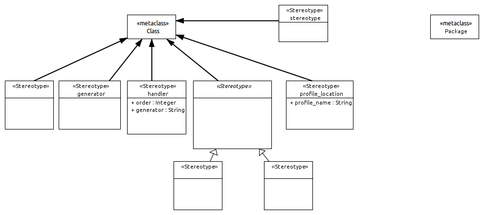
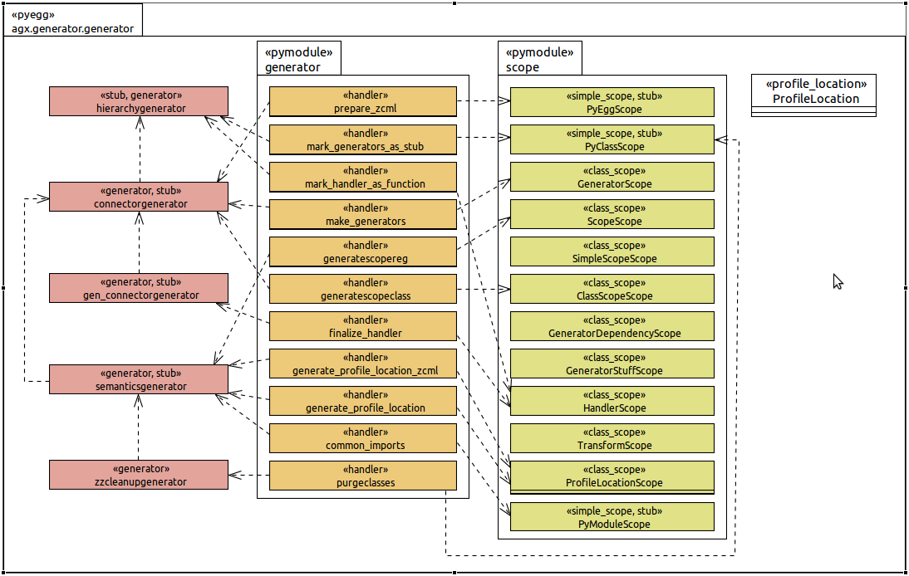
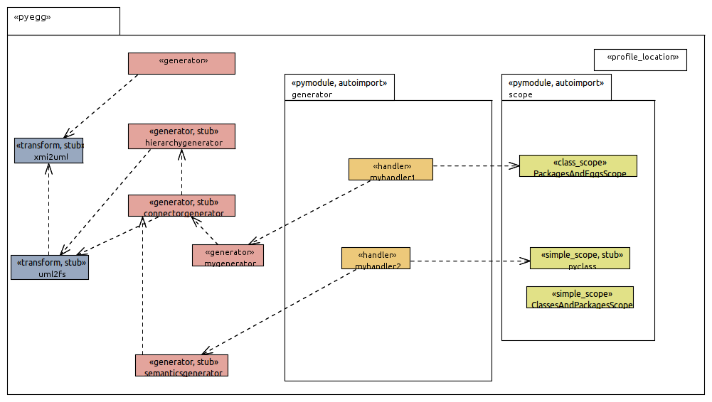

======================
Generator Generation
======================

The generator used when generating code from UML models with AGX is also modeled
and generated using UML and AGX.

Click on this image for a larger view.

Profile
=========

----------------------
UML:Foo
----------------------

The Generators Model
=====================

A Model for Tests
==================

The following image is used to test the generation framework.
Does it ouput what was intended? We use continuous integration tests
to avoid or at least detect regressions.

