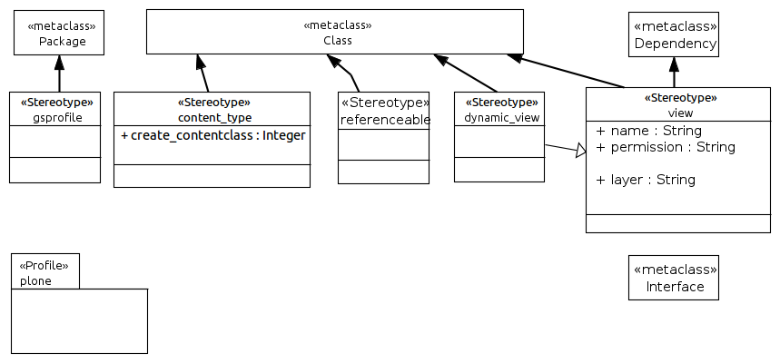
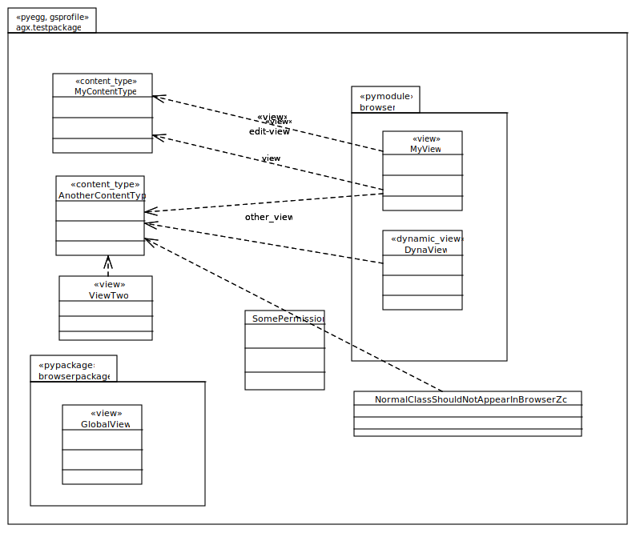

==================
UML:Profile plone
==================

This document describes the UML profile used for Plone Products
with Generic Setup profiles. 
Model Products with Generic Setup Profiles for Plone.

Overview
---------

UML:Stereotype <<gsprofile>>
-----------------------------

This stereotype can be attached to packages. In combination with the <<pyegg>>
stereotype can build eggs good for use as plugins for Plone.

Metaclasses
~~~~~~~~~~~~
- UML:Package

Tagged Values
~~~~~~~~~~~~~~

**None**

UML:Stereotype <<content_type>>
--------------------------------

Turn a class into a content type.

Metaclasses
~~~~~~~~~~~~
- UML:Class

Tagged Values
~~~~~~~~~~~~~~

**create_contentclass**
    Integer

UML:Stereotype <<referencable>>
--------------------------------

This stereotype can be attached to classes if they are to be made referencable.

Metaclasses
~~~~~~~~~~~~
- UML:Class

Tagged Values
~~~~~~~~~~~~~~

**None**

UML:Stereotype <<dynamic view>>
--------------------------------

A dynamic view class. It actually is a view

Metaclasses
~~~~~~~~~~~~
- UML:Class

Tagged Values
~~~~~~~~~~~~~~

**None**

UML:Stereotype <<view>>
------------------------

This stereotype can be attached to packages.

Metaclasses
~~~~~~~~~~~~
- UML:Class
- UML:Dependency

Tagged Values
~~~~~~~~~~~~~~

**name**
    String: name of the view.

**permission**
    String: permission for that view.

**layer**
    String: the layer the view is in.

Example Model (used for tests)
-------------------------------

An these files are generated on the file system:
::

  ├── LICENSE.rst
  ├── MANIFEST.rst
  ├── README.rst
  ├── setup.py
  └── src
       └── agx
            ├── __init__.py
            └── testpackage
                 ├── __init__.py
                 ├── anothercontenttype.py
                 ├── browser.py
                 ├── browser.zcml
                 ├── browserpackage
                 │   ├── __init__.py
                 │   ├── browser.zcml
                 │   ├── configure.zcml
                 │   ├── globalview.py
                 │   └── templates
                 │       └── globalview.pt
                 ├── configure.zcml
                 ├── mycontenttype.py
                 ├── normalclassshouldnotappearinbrowserzcml.py
                 ├── profiles
                 │   ├── default
                 │   │   ├── cssregistry.xml
                 │   │   ├── jsregistry.xml
                 │   │   └── metadata.xml
                 │   └── uninstall
                 ├── profiles.zcml
                 ├── resources
                 │   ├── main.css
                 │   └── main.js
                 ├── templates
                 │   ├── dynaview.pt
                 │   ├── edit_view.pt
                 │   ├── myview_template.pt
                 │   ├── myview_view.pt
                 │   └── viewtwo.pt
                 └── viewtwo.py
