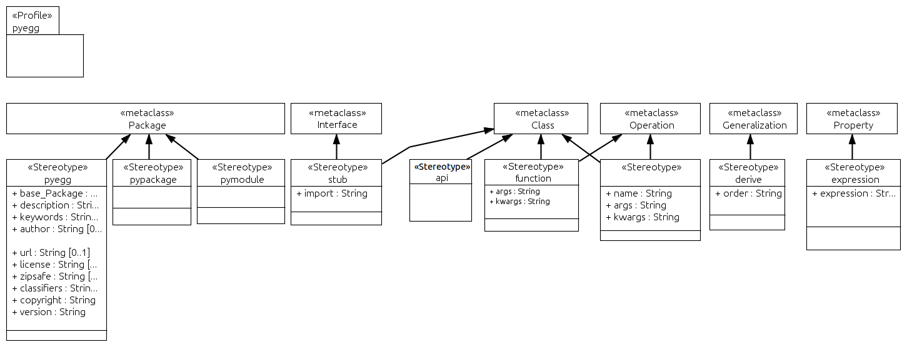
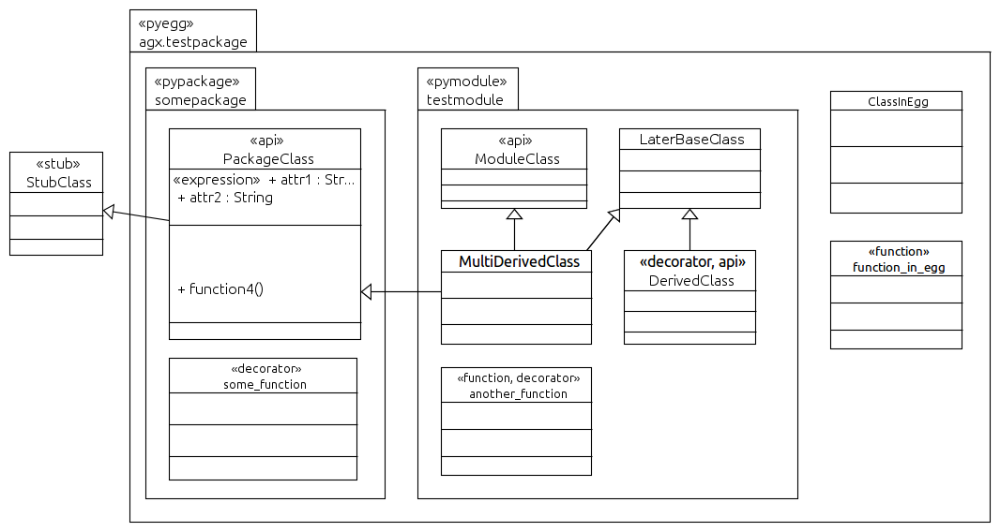

=================
UML:Profile pyegg
=================

Create Python Eggs and generate Python Code.

Overview
--------

**pyegg** UML profile overview.

UML:Stereotype <<pyegg>>
------------------------

Create or point at (reference and import) a complete python egg structure. 
A pyegg package can be given a dotted name. A split name represents namespace
packages. Package directories are located in the ``src`` folder of the egg
root. A ``README.txt`` is created if inexistent. ``setup.py`` is created or
referenced.

Metaclasses
~~~~~~~~~~~

- UML:Package

Tagged Values
~~~~~~~~~~~~~

**version**
    Used as ``version`` in setup.

**description**
    Used as ``description`` in setup.

**author**
    Used as ``author`` in setup.

**email**
    Used as ``author_email`` in setup.

**keywords**
    Used as ``keywords`` in setup.

**url**
    Used as ``url`` in setup.

**license**
    Used as ``license`` in setup.

**zipsafe**
    Used as ``zipsafe`` in setup. Either ``True`` or ``False``.

**classifiers**
    Used as ``classifiers`` in setup. Valid Classifiers can be
    found at  `<http://pypi.python.org/pypi?%3Aaction=list_classifiers>`_.
    Classifiers must be seperated by comma (``,``).

**copyright**
    Used as copyright header for python modules. A linebreak is
    indicated by linefeed (``\n``).

UML:Stereotype <<pypackage>>
----------------------------

Create or point to the directory with package name and create or point at a
package's ``__init__.py`` file.

Metaclasses
~~~~~~~~~~~

- UML:Package

Tagged Values
~~~~~~~~~~~~~

**None**

UML:Stereotype <<pymodule>>
---------------------------

Treat package as python module. Thus create or point at a python file with a
package name. All classes in this package are written into same module instead
of creating module files for each class in a UML package if marked with
``pypackage``.

Metaclasses
~~~~~~~~~~~

- UML:Package

Tagged Values
~~~~~~~~~~~~~

**None**

UML:Stereotype <<stub>>
-----------------------

Indicate class as stub. Used for generalization of 3rd-party objects.

Metaclasses
~~~~~~~~~~~

- UML:Class

Tagged Values
~~~~~~~~~~~~~

**import**
    Package name to import general class from, i.e. assuming class name is
    ``Baz``, setting value to ``foo.bar`` results in
    ``from foo.bar import Baz``.

UML:Stereotype <<decorator>>
----------------------------

Define a python decorator.

If ``args`` and ``kwargs`` are omitted in the model, they're never touched,
change them in the generated code as you like.

Metaclasses
~~~~~~~~~~~

- UML:Class
- UML:Operation

Tagged Values
~~~~~~~~~~~~~

**name**
    Decorator name.

**args**
    Arguments passed to decorator, i.e. ``foo, bar``. Arguments must be
    seperated by comma (``,``).

**kwargs**
    Keyword arguments passed to decorator, i.e. ``foo=0, bar=1``. Keyword
    arguments must be seperated by comma (``,``).

UML:Stereotype <<derive>>
-------------------------

Derive settings.

Metaclasses
~~~~~~~~~~~

- UML:Generalization

Tagged Values
~~~~~~~~~~~~~

**order**
    If UML Class inherits from 2 or more bases but order matters, set integer
    value for all generalizations. Lower value for the one needed first.

UML:Stereotype <<expression>>
-----------------------------

Set an expression for UML Property. Normally you do not model properties on
python level, except they are useful for documentation or semantic reasons.
Even if, value is set to ``None`` by default. Expression stereotype provides
changing this.

Metaclasses
~~~~~~~~~~~

- UML:Property

Tagged Values
~~~~~~~~~~~~~

**expression**
    Some python expression, i.e. ``[x for x in ["xxx"]]``.

An Example Model (for tests)
----------------------------

This model is used for the tests of this package.

