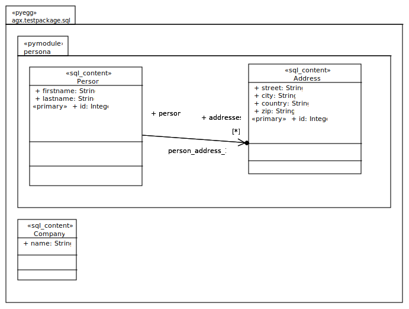

========
SQL ORM
========

.. note:: 

   Experienced developers can jump to :ref:`profile_sql` 

Example Model (used for tests)
-------------------------------

Filesystem representation:
::
 agx.generator.sql-sample
  ├── LICENSE.rst
  ├── MANIFEST.rst
  ├── README.rst
  ├── setup.py
  └── src
       └── agx
            ├── __init__.py
            └── testpackage
                 ├── __init__.py
                 └── sql
                      ├── __init__.py
                      ├── company.py
                      └── personal.py

The interesting bits are in personal.py:

.. code-block:: python

  # -*- coding: utf-8 -*-

  from sqlalchemy.orm import relationship
  from sqlalchemy import (
      Column,
      Integer,
      String,
      ForeignKey,
  )
  from sqlalchemy.ext.declarative import declarative_base

  Base = declarative_base()

  class Person(Base):

      __tablename__ = 'person'
      firstname = Column(String)
      lastname = Column(String)
      id = Column(Integer, index=True, primary_key=True)
      addresses = relationship(
          'Address', backref='person',
          primaryjoin='Address.person_id==Person.id')

  class Address(Base):

      __tablename__ = 'address'
      street = Column(String)
      city = Column(String)
      country = Column(String)
      zip = Column(String)
      id = Column(Integer, index=True, primary_key=True)
      person_id = Column(Integer, ForeignKey('person.id'), nullable=False)
