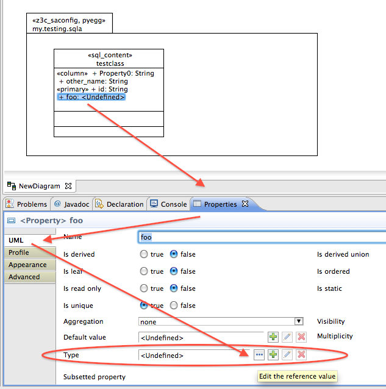
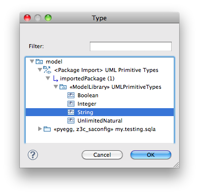

=================
UML:Profile sql
=================

Overview
---------

This document describes the UML profile for SQL.

.. image:: profile_sql.svg
   :scale: 50%

UML:Stereotype <<sql_content>>
-------------------------------

Metaclasses
~~~~~~~~~~~~
- UML:Class

Tagged Values
~~~~~~~~~~~~~~

**None**

UML:Stereotype <<sql_table>>
-----------------------------

Metaclasses
~~~~~~~~~~~~
- UML:Class

Tagged Values
~~~~~~~~~~~~~~

**None**

UML:Stereotype <<sql_concrete_table_inheritance>>
--------------------------------------------------

Metaclasses
~~~~~~~~~~~~
- UML:Class

Tagged Values
~~~~~~~~~~~~~~

**None**

UML:Stereotype <<joined_table_inheritance>>
--------------------------------------------

Metaclasses
~~~~~~~~~~~~
- UML:Class

Tagged Values
~~~~~~~~~~~~~~

**None**

UML:Stereotype <<column>>
--------------------------

Metaclasses
~~~~~~~~~~~~
- UML:Property

Tagged Values
~~~~~~~~~~~~~~

**index**
    Boolean

**not_null**
    Boolean

**unique**
    Boolean

**default**
    String

**server_default**
    String

UML:Stereotype <<primary>>
---------------------------

Special type of <<column>>

Metaclasses
~~~~~~~~~~~~
- UML:Property

Tagged Values
~~~~~~~~~~~~~~

**None**

UML:Stereotype <<sql_type>>
----------------------------

Metaclasses
~~~~~~~~~~~~
- UML:PrimitiveType

Tagged Values
~~~~~~~~~~~~~~

**classname**
    String

**import_from**
    String

**default**
    String

UML:Stereotype <<z3c_saconfig>>
--------------------------------------------

Metaclasses
~~~~~~~~~~~~
- UML:Package

Tagged Values
~~~~~~~~~~~~~~

**engine_name**
    String

**engine_url**
    String

**session_name**
    String

UML:Stereotype <<attribute_maped>>
-----------------------------------

Metaclasses
~~~~~~~~~~~~
- UML:Association

Tagged Values
~~~~~~~~~~~~~~

**key**
    String

UML:Stereotype <<lazy>>
------------------------

Metaclasses
~~~~~~~~~~~~
- UML:Association

Tagged Values
~~~~~~~~~~~~~~

**laziness**
    String

UML:Stereotype <<ordered>>
---------------------------

Metaclasses
~~~~~~~~~~~~
- UML:Association

Tagged Values
~~~~~~~~~~~~~~

**order_by**
    String

Import and Use Basic Datatypes
-------------------------------

Import
~~~~~~~
If you want to use standard data types like **Boolean**, **Integer**, **String**
or **UnlimitedNatural** in your model as datatypes of *Properties* (i.e. attributes)
in **sql_content** classes, you need to import the standard data types into your model.

Change to the **Papyrus Perspective** and look at the **Model Explorer**.
The topmost node is called **model**. Right-click it and select
**Import package from registered library**.

Choose **UMLPrimitiveTypes** and confirm with **OK**.
The standard data types will now be available throughout the model.

Use
~~~~
When modelling classes with stereotype **sql_content** you have to choose a
data type for each property (aka attribute). If there is no datatype attached,
AGX will barf:
::

 Start AGX
 AGX: Read configured profiles
 AGX: Invoke generator
 Command: /Users/christophscheid/Documents/workspace/agx.dev/bin/agx /Users/christophscheid/Documents/workspace/sqla.testing/sqla.model.uml -p /Users/christophscheid/Documents/workspace/agx.dev/devsrc/agx.generator.pyegg/src/agx/generator/pyegg/profiles/pyegg.profile.uml,/Users/christophscheid/Documents/workspace/agx.dev/devsrc/agx.generator.sql/src/agx/generator/sql/profiles/sql.profile.uml -o /Users/christophscheid/Documents/workspace/sqla.testing
 INFO  AGX 3.0-dev - (c) BlueDynamics Alliance, http://bluedynamics.com, GPL 2
 Traceback (most recent call last):
   File "/Users/christophscheid/Documents/workspace/agx.dev/bin/agx", line 50, in <module>
     sys.exit(agx.dev.main.run())
   File "/Users/christophscheid/Documents/workspace/agx.dev/src/agx/dev/main.py", line 15, in run
     agx.core.main.run()
   ...
   File "/Users/christophscheid/Documents/workspace/agx.dev/devsrc/agx.core/src/agx/core/_api.py", line 299, in __call__
     self._callfunc(self, source, target)
   File "/Users/christophscheid/Documents/workspace/agx.dev/devsrc/agx.generator.uml/src/agx/generator/uml/datatypedependent.py",  line 57, in property
     (source.element.get('name'),source.parent.element.get('name'))
 ValueError: Property "foo" in class "testclass" has no datatype!

So when adding a property, it has type *<Undefined>* by default.
To change it to be a **String** (or **Integer**, **Boolean**, ...) go to the
**Properties** window, select tab **UML**, and under **Type** (where it states
`<Undefined>` klick on the button with the three dots.

A window will pop up. Open the tree until you find the relevant type.

Example Model (used for tests)
-------------------------------

.. image:: model_agx-generator-sql_example.svg
   :scale: 50%

Filesystem representation:
::
 agx.generator.sql-sample
  ├── LICENSE.rst
  ├── MANIFEST.rst
  ├── README.rst
  ├── setup.py
  └── src
       └── agx
            ├── __init__.py
            └── testpackage
                 ├── __init__.py
                 └── sql
                      ├── __init__.py
                      ├── company.py
                      └── personal.py

The interesting bits are in personal.py:

.. code-block:: python

  # -*- coding: utf-8 -*-

  from sqlalchemy.orm import relationship
  from sqlalchemy import (
      Column,
      Integer,
      String,
      ForeignKey,
  )
  from sqlalchemy.ext.declarative import declarative_base

  Base = declarative_base()

  class Person(Base):

      __tablename__ = 'person'
      firstname = Column(String)
      lastname = Column(String)
      id = Column(Integer, index=True, primary_key=True)
      addresses = relationship(
          'Address', backref='person',
          primaryjoin='Address.person_id==Person.id')

  class Address(Base):

      __tablename__ = 'address'
      street = Column(String)
      city = Column(String)
      country = Column(String)
      zip = Column(String)
      id = Column(Integer, index=True, primary_key=True)
      person_id = Column(Integer, ForeignKey('person.id'), nullable=False)
