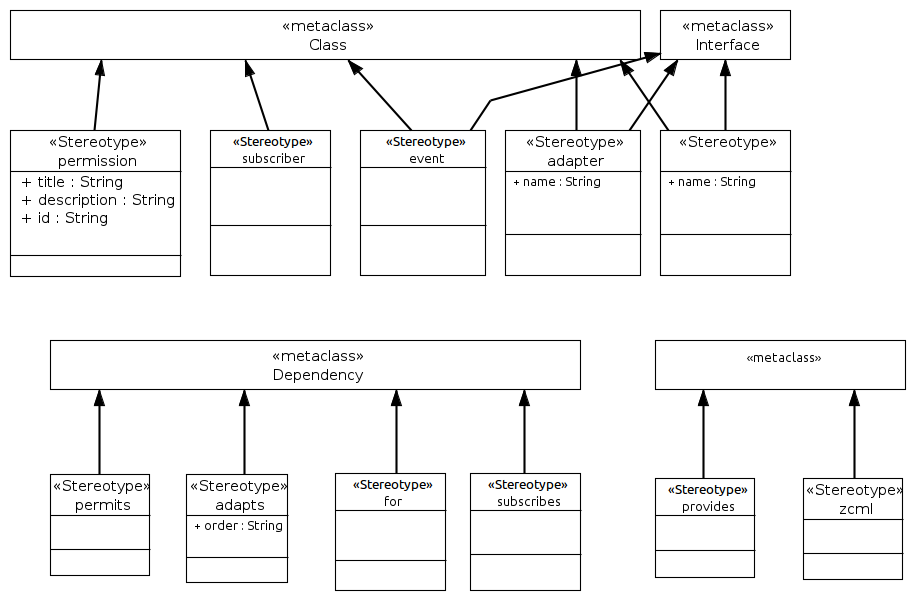

========================================
Using the Zope Component Architecture
========================================

This document describes the **ZCA** UML profile.

ZCA Profile
=============

-----------------
UML:Class
-----------------

<<permission>>
-----------------

write me. XXX

**Tagged Values**

- **title**: write me, XXX

- **description**: write me, XXX

- **id**: write me, XXX

<<subscriber>>
-----------------

write me. XXX

<<event>>
-----------------

write me. XXX

<<adapter>>
-----------------

write me. XXX

**Tagged Values**

- **name**: write me, XXX

<<empty>>
----------------

write me. XXX

**Tagged Values**

- **name**: write me, XXX

----------------
UML:Interface
----------------

<<event>>
-----------------

write me. XXX

<<adapter>>
-----------------

write me. XXX

**Tagged Values**

- **name**: write me, XXX

<<empty>>
----------------

write me. XXX

**Tagged Values**

- **name**: write me, XXX

-----------------
UML:Dependency
-----------------

<<permits>>
-----------

write me. XXX

<<adapts>>
------------

write me. XXX

**Tagged Values**

- **order**: write me, XXX

<<for>>
------------

write me. XXX

<<subscribes>>
------------
