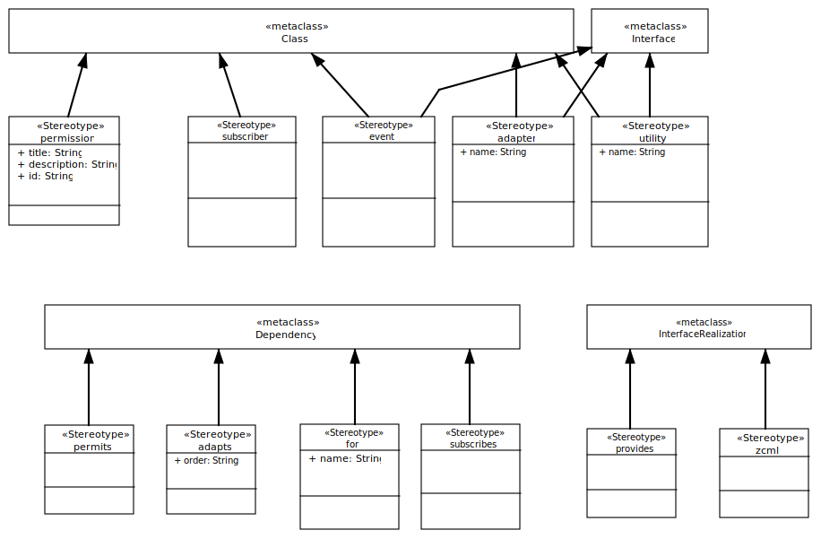
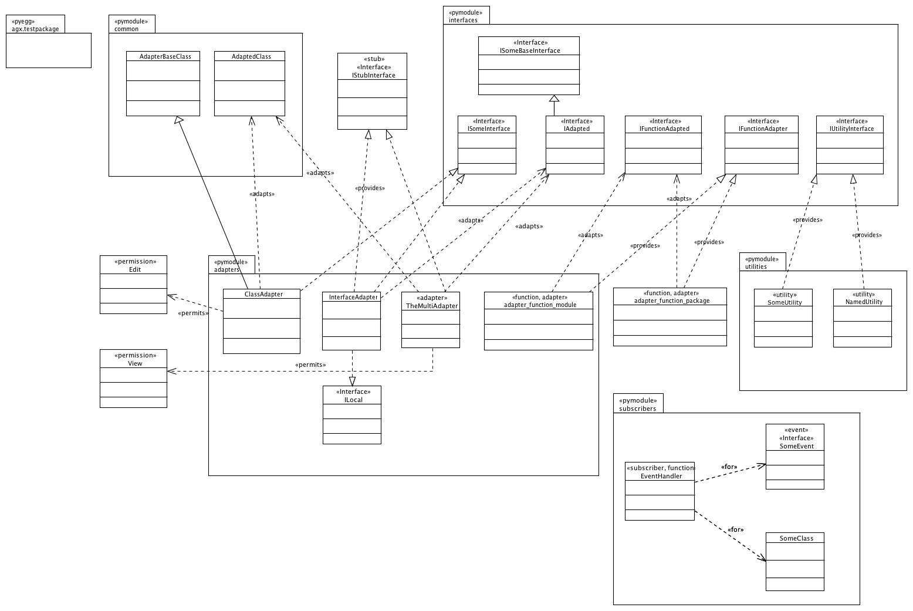
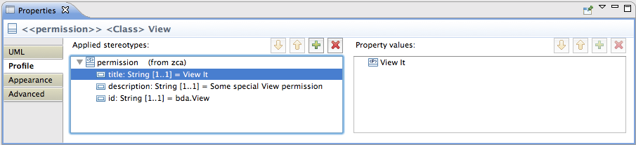

========================================
Using the Zope Component Architecture
========================================

The Zope Component Architecture
deals with the Adapter design pattern and uses Interfaces heavily.

The Python programming language does not have a notion of interfaces, but the
ZCA offers a solution, making use of several core packages:

- zope.interface

- zope.event

- zope.component

Overview
---------

This document describes the **ZCA** UML profile.

UML:Stereotype <<permission>>
------------------------------

Permission settings. 

Metaclasses
~~~~~~~~~~~~

- UML:Class

Tagged Values
~~~~~~~~~~~~~~

**title**
    Name of permission.

**description**
    Description of permission.

**id**
    Id of permission.

UML:Stereotype <<subscriber>>
------------------------------

Metaclasses
~~~~~~~~~~~~

- UML:Class

Tagged Values
~~~~~~~~~~~~~~

**None**

UML:Stereotype <<event>>
-------------------------

Metaclasses
~~~~~~~~~~~~

- UML:Class
- UML:Interface

Tagged Values
~~~~~~~~~~~~~~

**None**

UML:Stereotype <<adapter>>
---------------------------

Metaclasses
~~~~~~~~~~~~

- UML:Class
- UML:Interface

Tagged Values
~~~~~~~~~~~~~~

**name**
    String: name of the adapter.

UML:Stereotype <<utility>>
---------------------------

Utilities modelled as Classes with outgoing dependencies (with the <<provides>>
stereotype) to some interface.

Metaclasses
~~~~~~~~~~~~

- UML:Class
- UML:Interface

Tagged Values
~~~~~~~~~~~~~~

**name**
    String: a name for it.

UML:Stereotype <<adapts>>
--------------------------

Draw a dependency from an **Adapter** to an adapted class or interface.

Metaclasses
~~~~~~~~~~~~

- UML:Dependency

Tagged Values
~~~~~~~~~~~~~~

**order**
    String: the order of adaption.

UML:Stereotype <<permits>>
---------------------------

Dependency between **Adapter** and a **Permission**.

Metaclasses
~~~~~~~~~~~~

- UML:Dependency

Tagged Values
~~~~~~~~~~~~~~

**None**

UML:Stereotype <<for>>
-----------------------

Metaclasses
~~~~~~~~~~~~

- UML:Dependency

Tagged Values
~~~~~~~~~~~~~~

**None**

UML:Stereotype <<subscribes>>
------------------------------

Metaclasses
~~~~~~~~~~~~

- UML:Dependency

Tagged Values
~~~~~~~~~~~~~~

**None**

UML:Stereotype <<provides>>
----------------------------

Metaclasses
~~~~~~~~~~~~

- UML:InterfaceRealization

Tagged Values
~~~~~~~~~~~~~~

**None**

UML:Stereotype <<zcml>>
------------------------

Metaclasses
~~~~~~~~~~~~

- UML:InterfaceRealization

Tagged Values
~~~~~~~~~~~~~~

**None**

Example Model
--------------

This model is used for tests:

The following structure of files and folders is created on the file system when
AGX is given the example model as input for code generation.
::

   agx.generator.zca-sample
    ├── LICENSE.rst
    ├── MANIFEST.rst
    ├── README.rst
    ├── setup.py
    └── src
         └── agx
              ├── __init__.py
              └── testpackage
                   ├── __init__.py
                   ├── adapters.py              

                   ├── adapters.zcml            <zcml>
                   ├── common.py                

                   ├── configure.zcml           <zcml>
                   ├── interfaces.py            

                   ├── subscribers.py           

                   ├── subscribers.zcml         <zcml>
                   └── utilities.py             

Most of this follows from what has been said about the **pyegg** generator
documentation: A package named ``agx.testpackage`` assigned the <<pyegg>>
stereotype governs the hierarchy of folders (and the namespace managing __init__.py).

And all packages with the stereotype <<pymodule>> have manifested as .py files
(marked with 
 above).

The **adapter_function_package** has become a function definition in the
innermost __init__.py.

Two configuration files containing **Zope Component Markup Language (ZCML)** are generated:

- adapters.zcml and
- configure.zcml

configure.zcml
~~~~~~~~~~~~~~~

.. code-block:: xml

   <?xml version="1.0" encoding="UTF-8"?>
   <configure xmlns="http://namespaces.zope.org/zope">

     <permission
         id="bda.View"
         title="View It"
         description="Some special View permission"/>

     <permission id="agx.testpackage.Edit"/>

     <include file="adapters.zcml"/>

     <include file="subscribers.zcml"/>

   </configure>

Two entries for permissions were made: Edit and View.
The latter has tagged values to it as shown in this screenshot:

Two other include directives are there: for two more ZCML files.

adapters.zcml
~~~~~~~~~~~~~~

.. code-block:: xml

   <?xml version="1.0" encoding="UTF-8"?>
   <configure xmlns="http://namespaces.zope.org/zope">

     <adapter
        for="agx.testpackage.common.AdaptedClass"
        factory="agx.testpackage.adapters.ClassAdapter"
        provides="agx.testpackage.interfaces.ISomeInterface"
        permission="agx.testpackage.Edit"/>

     <adapter
        for="agx.testpackage.interfaces.IAdapted"
        name="interface_adapter"
        factory="agx.testpackage.adapters.InterfaceAdapter"
        provides="agx.somewhere_else.interfaces.IStubInterface"/>

     <adapter
        for="agx.testpackage.interfaces.IAdapted agx.testpackage.common.AdaptedClass"
        factory="agx.testpackage.adapters.TheMultiAdapter"
        provides="agx.somewhere_else.interfaces.IStubInterface"
        permission="bda.View"/>

   </configure>

Three adapters are configured. Note that TheMultiAdapter adapts two classes.

Two of these three adapters have permissions attached,
the third is a **named adapter**. It has a tagged value 'name'.

Named adapters can be found and used by their given name.

subscribers.zcml
~~~~~~~~~~~~~~~~~

.. code-block:: xml

   <?xml version="1.0" encoding="UTF-8"?>
   <configure xmlns="http://namespaces.zope.org/zope">

     <subscriber
         for="agx.testpackage.subscribers.SomeClass agx.testpackage.subscribers.SomeEvent"
         handler="agx.testpackage.subscribers.EventHandler"/>

   </configure>

The EventHandler subscriber (from the lower right corner of the model)
has subscriptions for two Classes.
